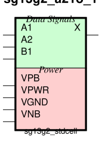

sg13g2_a21o
===========

2-input AND into first input of 2-input OR.

-  **Group name**: sg13g2_a21o
-  **Type**: cell
-  **Library**: sg13g2_stdcell
-  **Inputs**:  3 (A1, A2, B1)
-  **Outputs**: 1 (X)

sg13g2_a21o symbols
-------------------

    sg13g2_a21o symbol

sg13g2_a21o schematic
---------------------

    sg13g2_a21o schematic

sg13g2_a21o GDSII layouts
--------------------------

sg13g2_a21o_1
~~~~~~~~~~~~~

-  **Area**: 12.7008 µm²
-  **Pin Capacitance**:

   .. list-table::
      :widths: 50 50
      :header-rows: 1

      * - Pin
        - Capacitance (pF)
      * - A1
        - 0.00271758
      * - A2
        - 0.00280734
      * - B1
        - 0.00263163
      * - X
        - 0.001

.. figure:: ../../../_static/images/sg13g2_a21o_1.png
    :align: center
    :width: 80%

    sg13g2_a21o_1 layout

sg13g2_a21o_2
~~~~~~~~~~~~~

-  **Area**: 14.5152 µm²
-  **Pin Capacitance**:

   .. list-table::
      :widths: 50 50
      :header-rows: 1

      * - Pin
        - Capacitance (pF)
      * - A1
        - 0.00289873
      * - A2
        - 0.00289238
      * - B1
        - 0.00274853
      * - X
        - 0.001

.. figure:: ../../../_static/images/sg13g2_a21o_2.png
    :align: center
    :width: 80%

    sg13g2_a21o_2 layout
