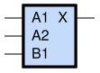
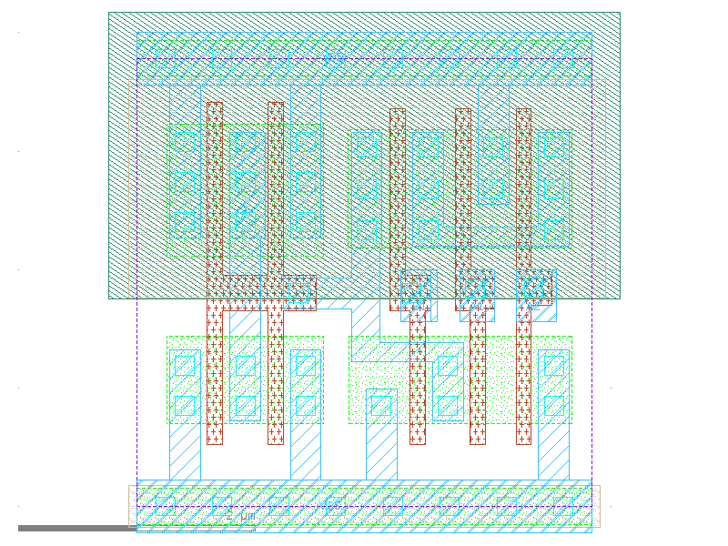

sg13g2_a21o_2
=============

2-input AND into first input of 2-input OR.

-  **Cell name**: sg13g2_a21o_2
-  **Type**: cell
-  **Verilog name**: sg13g2_a21o_2
-  **Library**: sg13g2_stdcell
-  **Inputs**:  3 (A1, A2, B1)
-  **Outputs**: 1 (X)

sg13g2_a21o_2 symbol
--------------------

    sg13g2_a21o_2 symbol

sg13g2_a21o_2 schematic
-----------------------

    sg13g2_a21o_2 schematic

sg13g2_a21o_2 GDSII layouts
----------------------------

    sg13g2_a21o_2 layout
