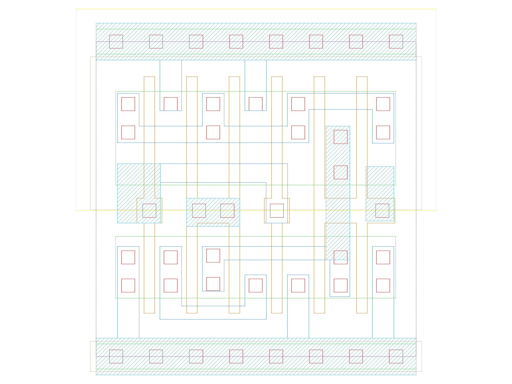

sg13g2_a21oi
============

2-input AND into first input of 2-input NOR.

-  **Group name**: sg13g2_a21oi
-  **Type**: cell
-  **Library**: sg13g2_stdcell
-  **Inputs**:  3 (A1, A2, B1)
-  **Outputs**: 1 (Y)

sg13g2_a21oi symbols
--------------------

.. figure:: ../../../_static/symbols/sg13g2_a21oi_1.svg
    :align: center
    :width: 60%

    sg13g2_a21oi symbol

sg13g2_a21oi schematic
----------------------

.. figure:: ../../../_static/schematics/sg13g2_a21oi_1.svg
    :align: center
    :width: 80%

    sg13g2_a21oi schematic

sg13g2_a21oi GDSII layouts
---------------------------

sg13g2_a21oi_1
~~~~~~~~~~~~~~

-  **Area**: 9.072 µm²
-  **Pin Capacitance**:

   .. list-table::
      :widths: 50 50
      :header-rows: 1

      * - Pin
        - Capacitance (pF)
      * - A1
        - 0.00301392
      * - A2
        - 0.00304949
      * - B1
        - 0.00287829
      * - Y
        - 0.001

.. figure:: ../../../_static/images/sg13g2_a21oi_1.png
    :align: center
    :width: 80%

    sg13g2_a21oi_1 layout

sg13g2_a21oi_2
~~~~~~~~~~~~~~

-  **Area**: 14.5152 µm²
-  **Pin Capacitance**:

   .. list-table::
      :widths: 50 50
      :header-rows: 1

      * - Pin
        - Capacitance (pF)
      * - A1
        - 0.00581309
      * - A2
        - 0.00608046
      * - B1
        - 0.00564011
      * - Y
        - 0.001

    sg13g2_a21oi_2 layout
