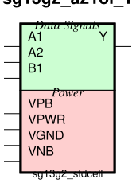
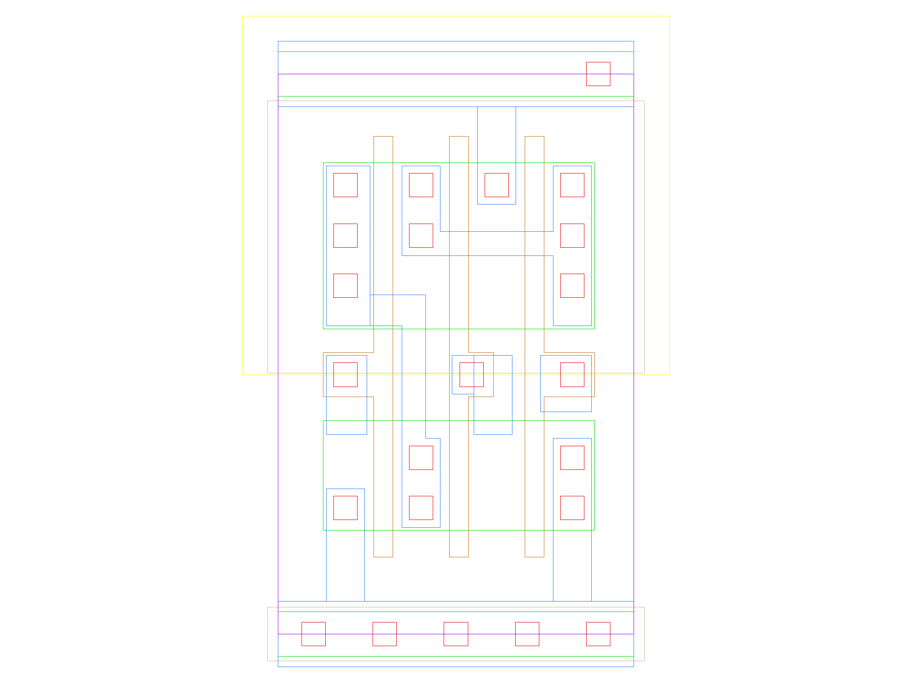

sg13g2_a21oi_1
==============

2-input AND into first input of 2-input NOR.

-  **Cell name**: sg13g2_a21oi_1
-  **Type**: cell
-  **Verilog name**: sg13g2_a21oi_1
-  **Library**: sg13g2_stdcell
-  **Inputs**:  3 (A1, A2, B1)
-  **Outputs**: 1 (Y)

Electrical and Physical Data
----------------------------

-  **Area**: 9.072 µm²
-  **Pin Capacitance**:

   .. list-table::
      :widths: 50 50
      :header-rows: 1

      * - Pin
        - Capacitance (pF)
      * - A1
        - 0.00301392
      * - A2
        - 0.00304949
      * - B1
        - 0.00287829
      * - Y
        - 0.001

sg13g2_a21oi_1 symbol
---------------------

    sg13g2_a21oi_1 symbol

sg13g2_a21oi_1 schematic
------------------------

    sg13g2_a21oi_1 schematic

sg13g2_a21oi_1 GDSII layouts
-----------------------------

    sg13g2_a21oi_1 layout
