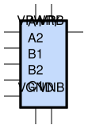
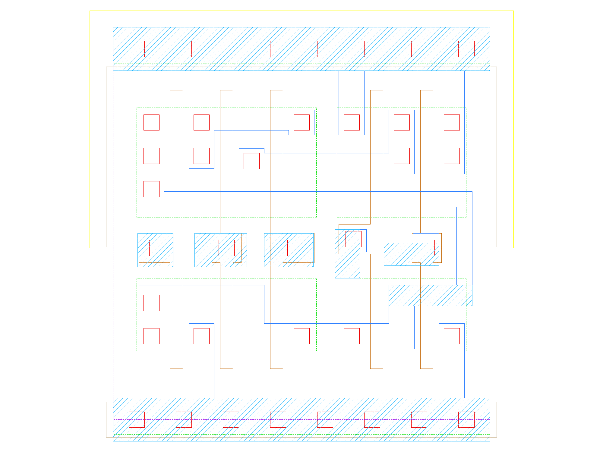

sg13g2_a221oi_1
===============

2-input AND into first two inputs of 3-input NOR.

-  **Cell name**: sg13g2_a221oi_1
-  **Type**: cell
-  **Verilog name**: sg13g2_a221oi_1
-  **Library**: sg13g2_stdcell
-  **Inputs**:  5 (A1, A2, B1, B2, C1)
-  **Outputs**: 1 (Y)

Electrical and Physical Data
----------------------------

-  **Area**: 14.5152 µm²
-  **Pin Capacitance**:

   .. list-table::
      :widths: 50 50
      :header-rows: 1

      * - Pin
        - Capacitance (pF)
      * - A1
        - 0.00296655
      * - A2
        - 0.00300247
      * - B1
        - 0.00292453
      * - B2
        - 0.00302059
      * - C1
        - 0.0028559
      * - Y
        - 0.001

sg13g2_a221oi_1 symbol
----------------------

    sg13g2_a221oi_1 symbol

sg13g2_a221oi_1 schematic
-------------------------

    sg13g2_a221oi_1 schematic

sg13g2_a221oi_1 GDSII layouts
------------------------------

    sg13g2_a221oi_1 layout
