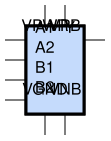

sg13g2_a22oi_1
==============

2-input AND into both inputs of 2-input NOR.

-  **Cell name**: sg13g2_a22oi_1
-  **Type**: cell
-  **Verilog name**: sg13g2_a22oi_1
-  **Library**: sg13g2_stdcell
-  **Inputs**:  4 (A1, A2, B1, B2)
-  **Outputs**: 1 (Y)

Electrical and Physical Data
----------------------------

-  **Area**: 10.8486 µm²
-  **Pin Capacitance**:

   .. list-table::
      :widths: 50 50
      :header-rows: 1

      * - Pin
        - Capacitance (pF)
      * - A1
        - 0.00310361
      * - A2
        - 0.00309576
      * - B1
        - 0.00303788
      * - B2
        - 0.00301537
      * - Y
        - 0.001

sg13g2_a22oi_1 symbol
---------------------

    sg13g2_a22oi_1 symbol

sg13g2_a22oi_1 schematic
------------------------

    sg13g2_a22oi_1 schematic

sg13g2_a22oi_1 GDSII layouts
-----------------------------

.. figure:: ../../../_static/images/sg13g2_a22oi_1.png
    :align: center
    :width: 80%

    sg13g2_a22oi_1 layout
