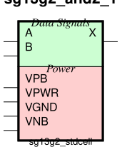
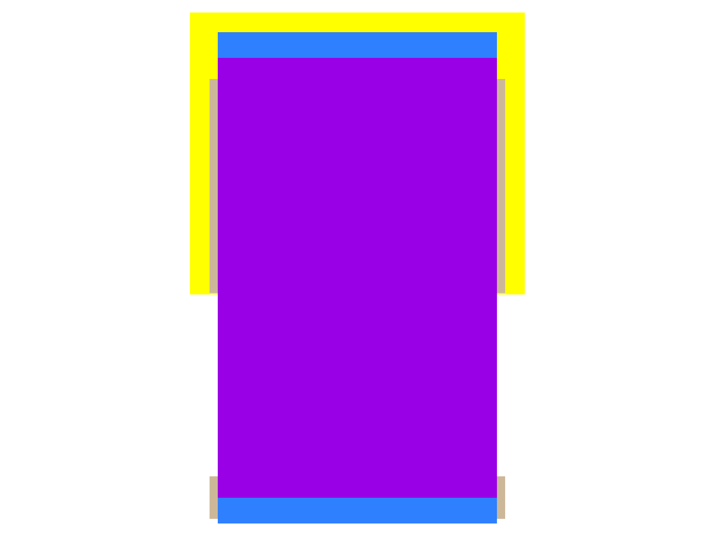

sg13g2_and2
===========

2-input AND

-  **Group name**: sg13g2_and2
-  **Type**: cell
-  **Library**: sg13g2_stdcell
-  **Inputs**:  2 (A, B)
-  **Outputs**: 1 (X)

sg13g2_and2 symbols
-------------------

    sg13g2_and2 symbol

sg13g2_and2 schematic
---------------------

    sg13g2_and2 schematic

sg13g2_and2 GDSII layouts
--------------------------

sg13g2_and2_1
~~~~~~~~~~~~~

-  **Area**: 9.072 µm²
-  **Pin Capacitance**:

   .. list-table::
      :widths: 50 50
      :header-rows: 1

      * - Pin
        - Capacitance (pF)
      * - A
        - 0.00254256
      * - B
        - 0.00253612
      * - X
        - 0.001

    sg13g2_and2_1 layout

sg13g2_and2_2
~~~~~~~~~~~~~

-  **Area**: 10.8864 µm²
-  **Pin Capacitance**:

   .. list-table::
      :widths: 50 50
      :header-rows: 1

      * - Pin
        - Capacitance (pF)
      * - A
        - 0.00253864
      * - B
        - 0.00255322
      * - X
        - 0.001

.. figure:: ../../../_static/images/sg13g2_and2_2.png
    :align: center
    :width: 80%

    sg13g2_and2_2 layout
