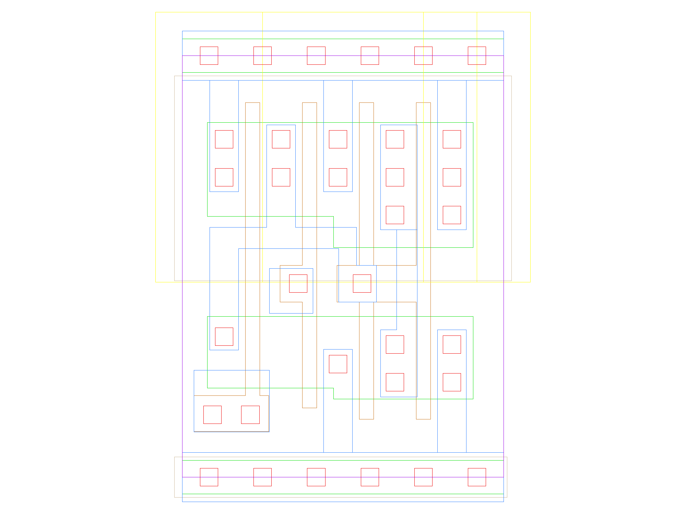

sg13g2_and2_2
=============

**AND2**

-  **Cell name**: sg13g2_and2_2
-  **Type**: cell
-  **Verilog name**: sg13g2_and2_2
-  **Library**: sg13g2_stdcell
-  **Inputs**:  2 (A, B)
-  **Outputs**: 1 (X)

sg13g2_and2_2 GDSII layouts
----------------------------

    sg13g2_and2_2
