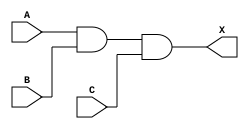
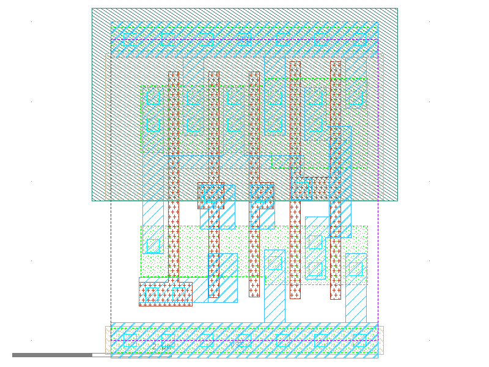

sg13g2_and3_2
=============

3-input AND

-  **Cell name**: sg13g2_and3_2
-  **Type**: cell
-  **Verilog name**: sg13g2_and3_2
-  **Library**: sg13g2_stdcell
-  **Inputs**:  3 (A, B, C)
-  **Outputs**: 1 (X)

sg13g2_and3_2 symbol
--------------------

.. figure:: ../../../_static/symbols/sg13g2_and3_2.svg
    :align: center
    :width: 60%

    sg13g2_and3_2 symbol

sg13g2_and3_2 schematic
-----------------------

    sg13g2_and3_2 schematic

sg13g2_and3_2 GDSII layouts
----------------------------

    sg13g2_and3_2 layout
