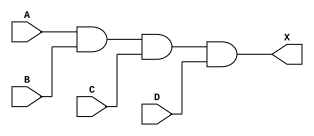
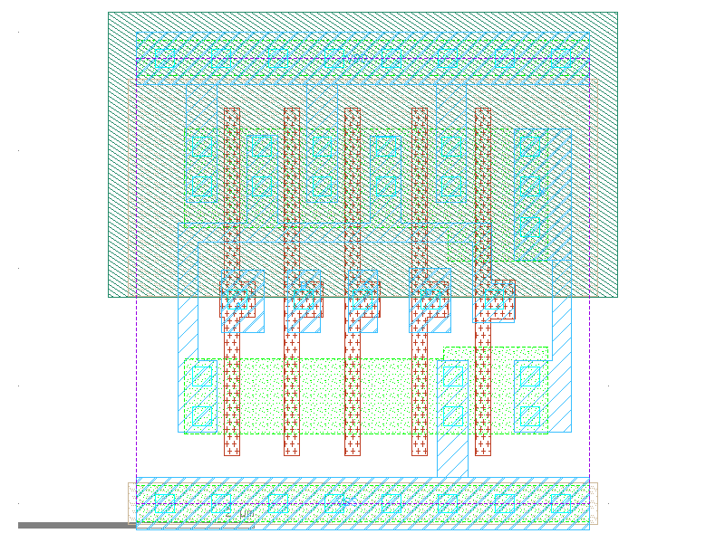
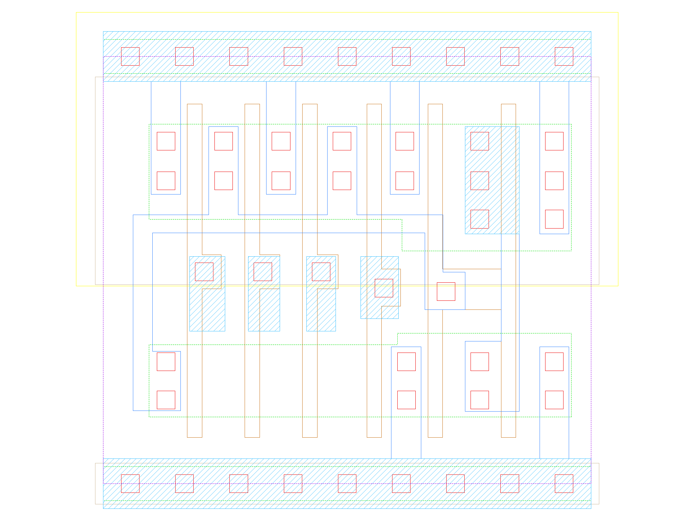

sg13g2_and4
===========

4-input AND

-  **Group name**: sg13g2_and4
-  **Type**: cell
-  **Library**: sg13g2_stdcell
-  **Inputs**:  4 (A, B, C, D)
-  **Outputs**: 1 (X)

sg13g2_and4 symbols
-------------------

.. figure:: ../../../_static/symbols/sg13g2_and4_1.svg
    :align: center
    :width: 60%

    sg13g2_and4 symbol

sg13g2_and4 schematic
---------------------

    sg13g2_and4 schematic

sg13g2_and4 GDSII layouts
--------------------------

sg13g2_and4_1
~~~~~~~~~~~~~

-  **Area**: 14.5152 µm²
-  **Pin Capacitance**:

   .. list-table::
      :widths: 50 50
      :header-rows: 1

      * - Pin
        - Capacitance (pF)
      * - A
        - 0.00236977
      * - B
        - 0.00249579
      * - C
        - 0.00249119
      * - D
        - 0.00249915
      * - X
        - 0.001

    sg13g2_and4_1 layout

sg13g2_and4_2
~~~~~~~~~~~~~

-  **Area**: 16.3296 µm²
-  **Pin Capacitance**:

   .. list-table::
      :widths: 50 50
      :header-rows: 1

      * - Pin
        - Capacitance (pF)
      * - A
        - 0.00237367
      * - B
        - 0.00249258
      * - C
        - 0.00249039
      * - D
        - 0.0024971
      * - X
        - 0.001

    sg13g2_and4_2 layout
