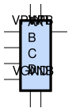

sg13g2_and4_2
=============

4-input AND

-  **Cell name**: sg13g2_and4_2
-  **Type**: cell
-  **Verilog name**: sg13g2_and4_2
-  **Library**: sg13g2_stdcell
-  **Inputs**:  4 (A, B, C, D)
-  **Outputs**: 1 (X)

Electrical and Physical Data
----------------------------

-  **Area**: 16.3296 µm²
-  **Pin Capacitance**:

   .. list-table::
      :widths: 50 50
      :header-rows: 1

      * - Pin
        - Capacitance (pF)
      * - A
        - 0.00237367
      * - B
        - 0.00249258
      * - C
        - 0.00249039
      * - D
        - 0.0024971
      * - X
        - 0.001

sg13g2_and4_2 symbol
--------------------

    sg13g2_and4_2 symbol

sg13g2_and4_2 schematic
-----------------------

    sg13g2_and4_2 schematic

sg13g2_and4_2 GDSII layouts
----------------------------

.. figure:: ../../../_static/images/sg13g2_and4_2.png
    :align: center
    :width: 80%

    sg13g2_and4_2 layout
