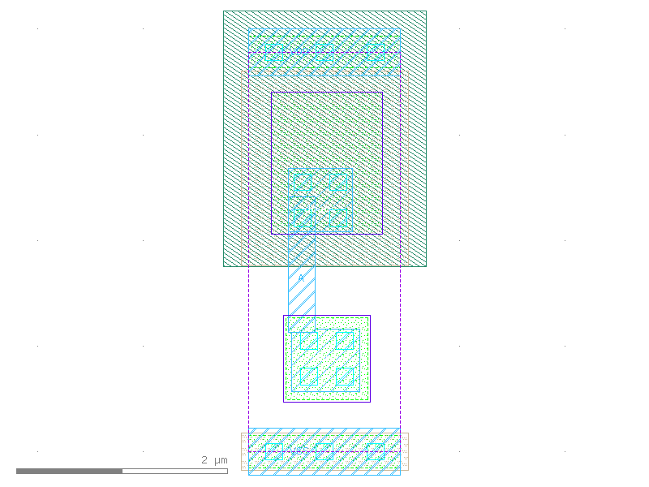

sg13g2_antennanp
================

Antenna effect protection cell (gate charge) at manufacture, P-diode in N-Well, N-diode in substrate

-  **Cell name**: sg13g2_antennanp
-  **Type**: cell
-  **Verilog name**: sg13g2_antennanp
-  **Library**: sg13g2_stdcell
-  **Inputs**:  1 (A)
-  **Outputs**: 0 ()

sg13g2_antennanp schematic
--------------------------

    sg13g2_antennanp schematic

sg13g2_antennanp GDSII layouts
-------------------------------

    sg13g2_antennanp layout
