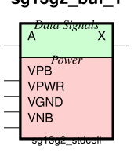
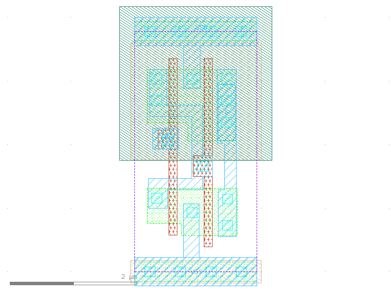

sg13g2_buf
==========

Buffer drive strength 1

-  **Group name**: sg13g2_buf
-  **Type**: cell
-  **Library**: sg13g2_stdcell
-  **Inputs**:  1 (A)
-  **Outputs**: 1 (X)

sg13g2_buf symbols
------------------

    sg13g2_buf symbol

sg13g2_buf schematic
--------------------

    sg13g2_buf schematic

sg13g2_buf GDSII layouts
-------------------------

sg13g2_buf_1
~~~~~~~~~~~~

-  **Area**: 7.2576 µm²
-  **Pin Capacitance**:

   .. list-table::
      :widths: 50 50
      :header-rows: 1

      * - Pin
        - Capacitance (pF)
      * - A
        - 0.00226339
      * - X
        - 0.001

    sg13g2_buf_1 layout

sg13g2_buf_16
~~~~~~~~~~~~~

-  **Area**: 45.36 µm²
-  **Pin Capacitance**:

   .. list-table::
      :widths: 50 50
      :header-rows: 1

      * - Pin
        - Capacitance (pF)
      * - A
        - 0.0170499
      * - X
        - 0.001

.. figure:: ../../../_static/images/sg13g2_buf_16.png
    :align: center
    :width: 80%

    sg13g2_buf_16 layout

sg13g2_buf_2
~~~~~~~~~~~~

-  **Area**: 9.072 µm²
-  **Pin Capacitance**:

   .. list-table::
      :widths: 50 50
      :header-rows: 1

      * - Pin
        - Capacitance (pF)
      * - A
        - 0.00261926
      * - X
        - 0.001

.. figure:: ../../../_static/images/sg13g2_buf_2.png
    :align: center
    :width: 80%

    sg13g2_buf_2 layout

sg13g2_buf_4
~~~~~~~~~~~~

-  **Area**: 14.5152 µm²
-  **Pin Capacitance**:

   .. list-table::
      :widths: 50 50
      :header-rows: 1

      * - Pin
        - Capacitance (pF)
      * - A
        - 0.00370215
      * - X
        - 0.001

.. figure:: ../../../_static/images/sg13g2_buf_4.png
    :align: center
    :width: 80%

    sg13g2_buf_4 layout

sg13g2_buf_8
~~~~~~~~~~~~

-  **Area**: 23.5872 µm²
-  **Pin Capacitance**:

   .. list-table::
      :widths: 50 50
      :header-rows: 1

      * - Pin
        - Capacitance (pF)
      * - A
        - 0.00856578
      * - X
        - 0.001

.. figure:: ../../../_static/images/sg13g2_buf_8.png
    :align: center
    :width: 80%

    sg13g2_buf_8 layout
