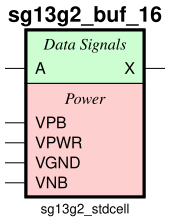
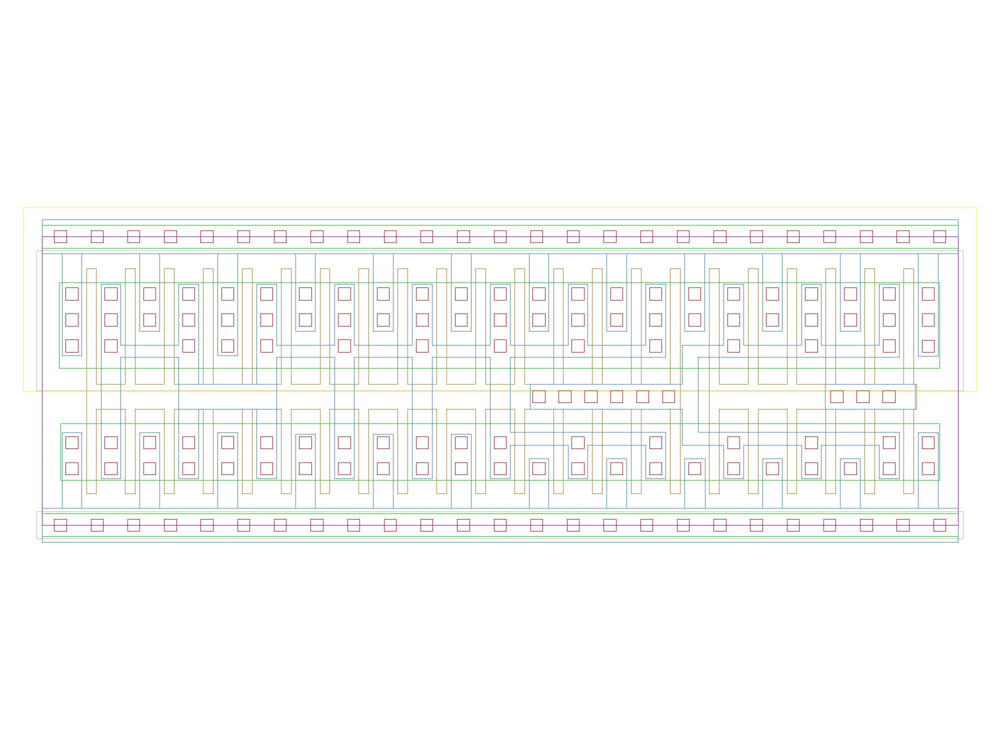

sg13g2_buf_16
=============

Buffer drive strength 16

-  **Cell name**: sg13g2_buf_16
-  **Type**: cell
-  **Verilog name**: sg13g2_buf_16
-  **Library**: sg13g2_stdcell
-  **Inputs**:  1 (A)
-  **Outputs**: 1 (X)

sg13g2_buf_16 symbol
--------------------

    sg13g2_buf_16 symbol

sg13g2_buf_16 schematic
-----------------------

.. figure:: ../../../_static/schematics/sg13g2_buf_16.svg
    :align: center
    :width: 80%

    sg13g2_buf_16 schematic

sg13g2_buf_16 GDSII layouts
----------------------------

    sg13g2_buf_16 layout
