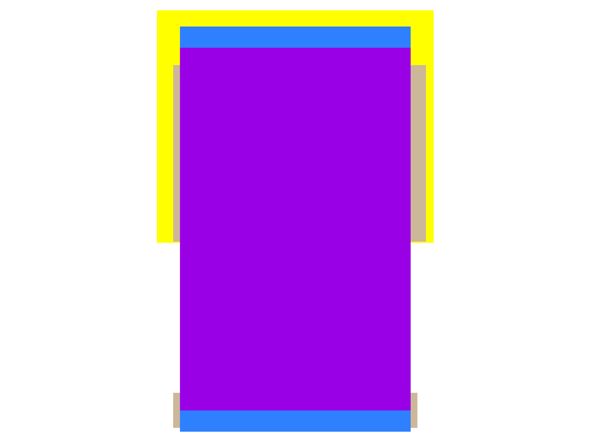

sg13g2_buf_2
============

Buffer drive strength 2

-  **Cell name**: sg13g2_buf_2
-  **Type**: cell
-  **Verilog name**: sg13g2_buf_2
-  **Library**: sg13g2_stdcell
-  **Inputs**:  1 (A)
-  **Outputs**: 1 (X)

sg13g2_buf_2 GDSII layouts
---------------------------

    sg13g2_buf_2
