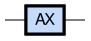

sg13g2_buf_4
============

Buffer drive strength 4

-  **Cell name**: sg13g2_buf_4
-  **Type**: cell
-  **Verilog name**: sg13g2_buf_4
-  **Library**: sg13g2_stdcell
-  **Inputs**:  1 (A)
-  **Outputs**: 1 (X)

Electrical and Physical Data
----------------------------

-  **Area**: 14.5152 µm²
-  **Pin Capacitance**:

   .. list-table::
      :widths: 50 50
      :header-rows: 1

      * - Pin
        - Capacitance (pF)
      * - A
        - 0.00370215
      * - X
        - 0.001

sg13g2_buf_4 symbol
-------------------

    sg13g2_buf_4 symbol

sg13g2_buf_4 schematic
----------------------

.. figure:: ../../../_static/schematics/sg13g2_buf_4.svg
    :align: center
    :width: 80%

    sg13g2_buf_4 schematic

sg13g2_buf_4 GDSII layouts
---------------------------

.. figure:: ../../../_static/images/sg13g2_buf_4.png
    :align: center
    :width: 80%

    sg13g2_buf_4 layout
