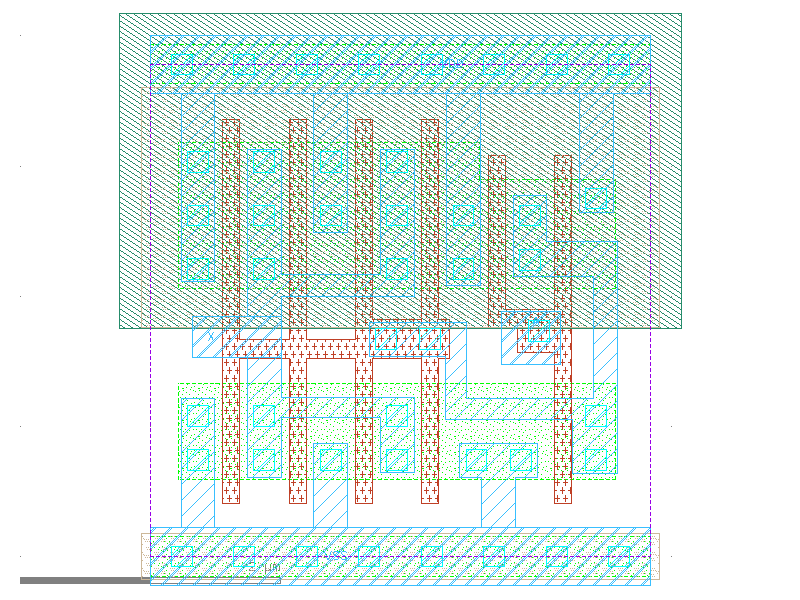

sg13g2_buf_4
============

Buffer drive strength 4

-  **Cell name**: sg13g2_buf_4
-  **Type**: cell
-  **Verilog name**: sg13g2_buf_4
-  **Library**: sg13g2_stdcell
-  **Inputs**:  1 (A)
-  **Outputs**: 1 (X)

sg13g2_buf_4 GDSII layouts
---------------------------

    sg13g2_buf_4
