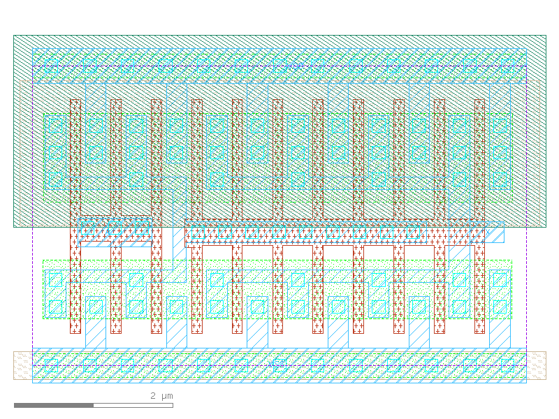

sg13g2_buf_8
============

Buffer drive strength 8

-  **Cell name**: sg13g2_buf_8
-  **Type**: cell
-  **Verilog name**: sg13g2_buf_8
-  **Library**: sg13g2_stdcell
-  **Inputs**:  1 (A)
-  **Outputs**: 1 (X)

sg13g2_buf_8 schematic
----------------------

.. figure:: ../../../_static/schematics/sg13g2_buf_8.svg
    :align: center
    :width: 80%

    sg13g2_buf_8 schematic

sg13g2_buf_8 GDSII layouts
---------------------------

    sg13g2_buf_8 layout
