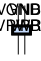
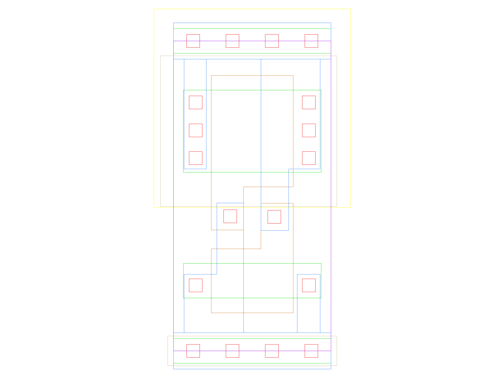

sg13g2_decap
============

Decoupling capasitance filler cell

-  **Group name**: sg13g2_decap
-  **Type**: cell
-  **Library**: sg13g2_stdcell
-  **Inputs**:  0 ()
-  **Outputs**: 0 ()

sg13g2_decap symbols
--------------------

    sg13g2_decap symbol

sg13g2_decap schematic
----------------------

.. figure:: ../../../_static/schematics/sg13g2_decap_4.svg
    :align: center
    :width: 80%

    sg13g2_decap schematic

sg13g2_decap GDSII layouts
---------------------------

sg13g2_decap_4
~~~~~~~~~~~~~~

-  **Area**: 7.2576 µm²

    sg13g2_decap_4 layout

sg13g2_decap_8
~~~~~~~~~~~~~~

-  **Area**: 12.7008 µm²

.. figure:: ../../../_static/images/sg13g2_decap_8.png
    :align: center
    :width: 80%

    sg13g2_decap_8 layout
