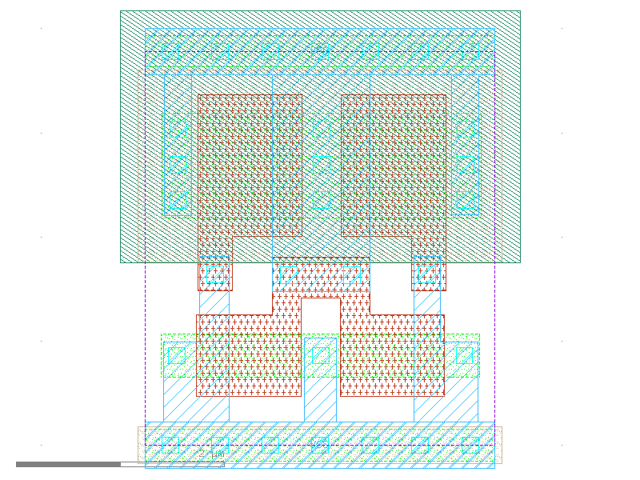

sg13g2_decap_8
==============

Decoupling capasitance filler cell

-  **Cell name**: sg13g2_decap_8
-  **Type**: cell
-  **Verilog name**: sg13g2_decap_8
-  **Library**: sg13g2_stdcell
-  **Inputs**:  0 ()
-  **Outputs**: 0 ()

sg13g2_decap_8 schematic
------------------------

.. figure:: ../../../_static/schematics/sg13g2_decap_8.svg
    :align: center
    :width: 80%

    sg13g2_decap_8 schematic

sg13g2_decap_8 GDSII layouts
-----------------------------

    sg13g2_decap_8 layout
