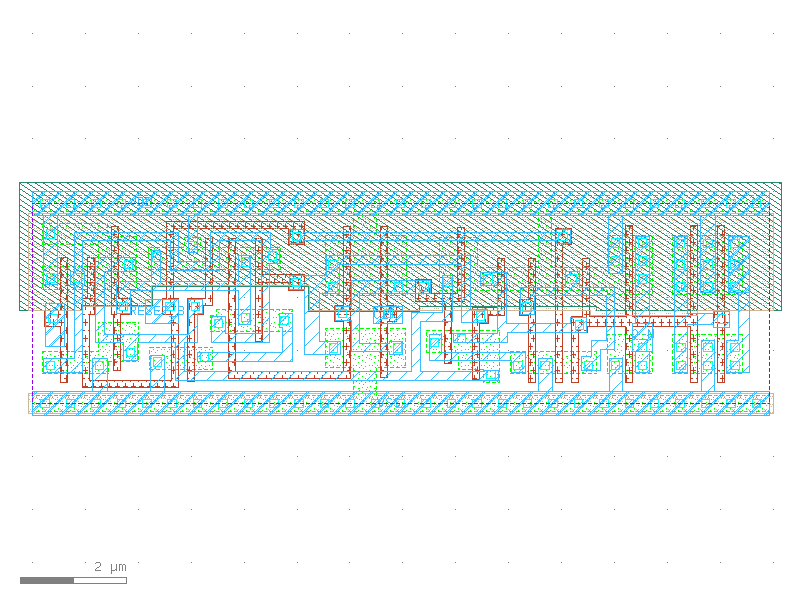

sg13g2_dfrbp_1
==============

Posedge Two-Outputs Q and Q_N D-Flip-Flop with Low-Active Reset

-  **Cell name**: sg13g2_dfrbp_1
-  **Type**: cell
-  **Verilog name**: sg13g2_dfrbp_1
-  **Library**: sg13g2_stdcell
-  **Inputs**:  3 (CLK, D, RESET_B)
-  **Outputs**: 2 (Q, Q_N)

Electrical and Physical Data
----------------------------

-  **Area**: 52.6176 µm²
-  **Pin Capacitance**:

   .. list-table::
      :widths: 50 50
      :header-rows: 1

      * - Pin
        - Capacitance (pF)
      * - CLK
        - 0.00279631
      * - D
        - 0.00154954
      * - Q
        - 0.001
      * - Q_N
        - 0.001
      * - RESET_B
        - 0.00513299

sg13g2_dfrbp_1 symbol
---------------------

.. figure:: ../../../_static/symbols/sg13g2_dfrbp_1.svg
    :align: center
    :width: 60%

    sg13g2_dfrbp_1 symbol

sg13g2_dfrbp_1 schematic
------------------------

.. figure:: ../../../_static/schematics/sg13g2_dfrbp_1.svg
    :align: center
    :width: 80%

    sg13g2_dfrbp_1 schematic

sg13g2_dfrbp_1 GDSII layouts
-----------------------------

    sg13g2_dfrbp_1 layout
