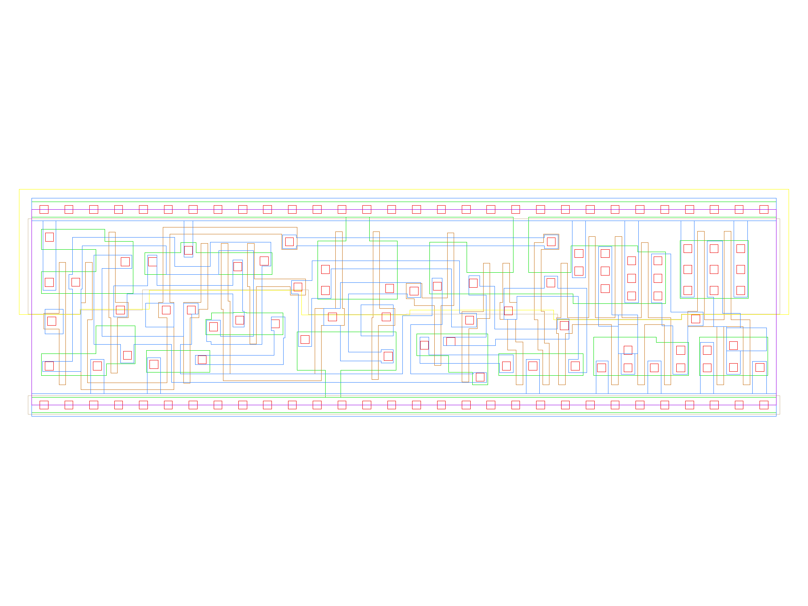

sg13g2_dfrbp_2
==============

Posedge Two-Outputs Q and Q_N D-Flip-Flop with Low-Active Reset

-  **Cell name**: sg13g2_dfrbp_2
-  **Type**: cell
-  **Verilog name**: sg13g2_dfrbp_2
-  **Library**: sg13g2_stdcell
-  **Inputs**:  3 (CLK, D, RESET_B)
-  **Outputs**: 2 (Q, Q_N)

sg13g2_dfrbp_2 schematic
------------------------

.. figure:: ../../../_static/schematics/sg13g2_dfrbp_2.svg
    :align: center
    :width: 80%

    sg13g2_dfrbp_2 schematic

sg13g2_dfrbp_2 GDSII layouts
-----------------------------

    sg13g2_dfrbp_2 layout
