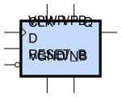
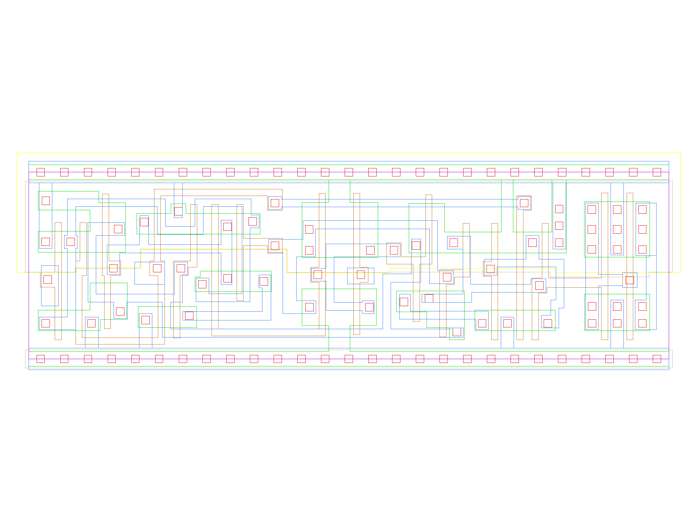

sg13g2_dfrbpq
=============

Posedge Single-Output Q D-Flip-Flop with Low-Active Reset

-  **Group name**: sg13g2_dfrbpq
-  **Type**: cell
-  **Library**: sg13g2_stdcell
-  **Inputs**:  3 (CLK, D, RESET_B)
-  **Outputs**: 1 (Q)

sg13g2_dfrbpq symbols
---------------------

    sg13g2_dfrbpq symbol

sg13g2_dfrbpq schematic
-----------------------

.. figure:: ../../../_static/schematics/sg13g2_dfrbpq_1.svg
    :align: center
    :width: 80%

    sg13g2_dfrbpq schematic

sg13g2_dfrbpq GDSII layouts
----------------------------

sg13g2_dfrbpq_1
~~~~~~~~~~~~~~~

-  **Area**: 48.9888 µm²
-  **Pin Capacitance**:

   .. list-table::
      :widths: 50 50
      :header-rows: 1

      * - Pin
        - Capacitance (pF)
      * - CLK
        - 0.00276976
      * - D
        - 0.00141954
      * - Q
        - 0.001
      * - RESET_B
        - 0.00508684

    sg13g2_dfrbpq_1 layout

sg13g2_dfrbpq_2
~~~~~~~~~~~~~~~

-  **Area**: 50.8032 µm²
-  **Pin Capacitance**:

   .. list-table::
      :widths: 50 50
      :header-rows: 1

      * - Pin
        - Capacitance (pF)
      * - CLK
        - 0.00277906
      * - D
        - 0.00142328
      * - Q
        - 0.001
      * - RESET_B
        - 0.00513072

.. figure:: ../../../_static/images/sg13g2_dfrbpq_2.png
    :align: center
    :width: 80%

    sg13g2_dfrbpq_2 layout
