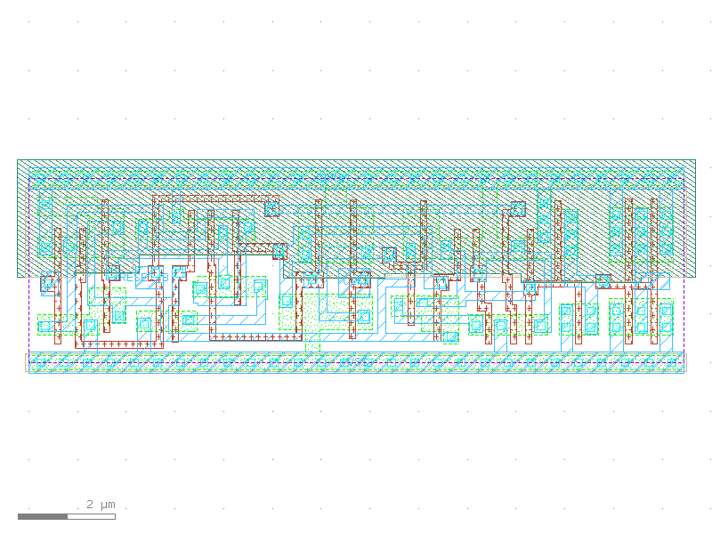

sg13g2_dfrbpq_2
===============

Posedge Single-Output Q D-Flip-Flop with Low-Active Reset

-  **Cell name**: sg13g2_dfrbpq_2
-  **Type**: cell
-  **Verilog name**: sg13g2_dfrbpq_2
-  **Library**: sg13g2_stdcell
-  **Inputs**:  3 (CLK, D, RESET_B)
-  **Outputs**: 1 (Q)

sg13g2_dfrbpq_2 GDSII layouts
------------------------------

    sg13g2_dfrbpq_2
