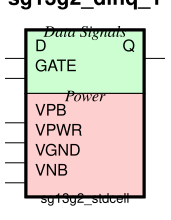
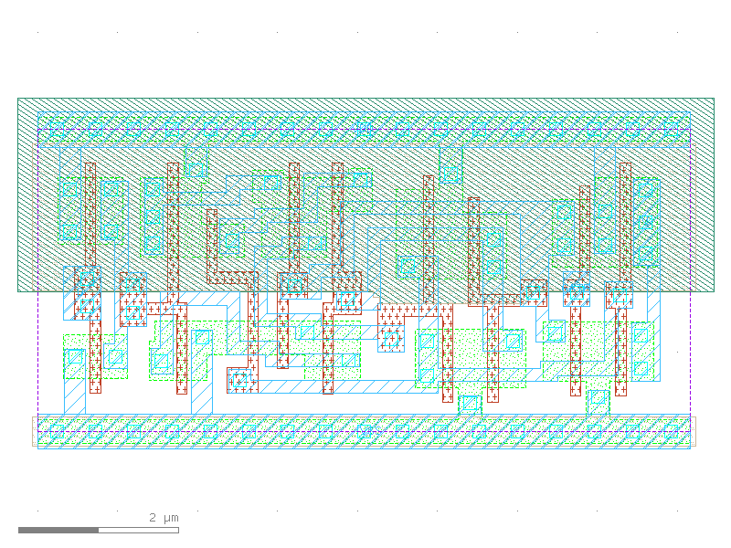

sg13g2_dlhq_1
=============

High-Active GATE Single-Output Q D-latch

-  **Cell name**: sg13g2_dlhq_1
-  **Type**: cell
-  **Verilog name**: sg13g2_dlhq_1
-  **Library**: sg13g2_stdcell
-  **Inputs**:  2 (D, GATE)
-  **Outputs**: 1 (Q)

Electrical and Physical Data
----------------------------

-  **Area**: 30.8448 µm²
-  **Pin Capacitance**:

   .. list-table::
      :widths: 50 50
      :header-rows: 1

      * - Pin
        - Capacitance (pF)
      * - D
        - 0.00228262
      * - GATE
        - 0.00228336
      * - Q
        - 0.001

sg13g2_dlhq_1 symbol
--------------------

    sg13g2_dlhq_1 symbol

sg13g2_dlhq_1 schematic
-----------------------

.. figure:: ../../../_static/schematics/sg13g2_dlhq_1.svg
    :align: center
    :width: 80%

    sg13g2_dlhq_1 schematic

sg13g2_dlhq_1 GDSII layouts
----------------------------

    sg13g2_dlhq_1 layout
