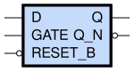

sg13g2_dlhr
===========

High-Active GATE Two-Outputs Q Q_N D-latch with Low-Active Reset

-  **Group name**: sg13g2_dlhr
-  **Type**: cell
-  **Library**: sg13g2_stdcell
-  **Inputs**:  3 (D, GATE, RESET_B)
-  **Outputs**: 2 (Q, Q_N)

sg13g2_dlhr symbols
-------------------

    sg13g2_dlhr symbol

sg13g2_dlhr schematic
---------------------

.. figure:: ../../../_static/schematics/sg13g2_dlhr_1.svg
    :align: center
    :width: 80%

    sg13g2_dlhr schematic

sg13g2_dlhr GDSII layouts
--------------------------

sg13g2_dlhr_1
~~~~~~~~~~~~~

-  **Area**: 32.6592 µm²
-  **Pin Capacitance**:

   .. list-table::
      :widths: 50 50
      :header-rows: 1

      * - Pin
        - Capacitance (pF)
      * - D
        - 0.00207682
      * - GATE
        - 0.00223878
      * - Q
        - 0.001
      * - Q_N
        - 0.001
      * - RESET_B
        - 0.00311214

.. figure:: ../../../_static/images/sg13g2_dlhr_1.png
    :align: center
    :width: 80%

    sg13g2_dlhr_1 layout
