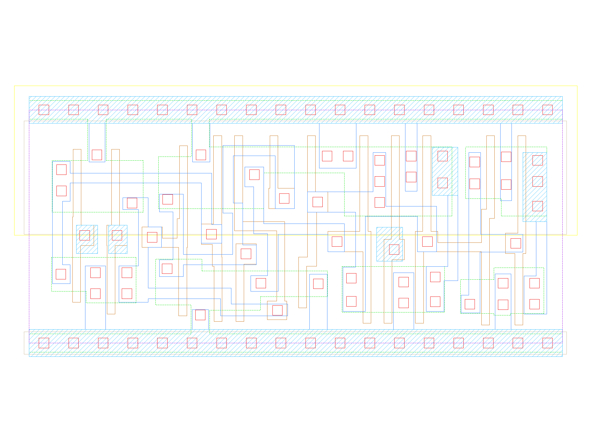

sg13g2_dlhr_1
=============

High-Active GATE Two-Outputs Q Q_N D-latch with Low-Active Reset

-  **Cell name**: sg13g2_dlhr_1
-  **Type**: cell
-  **Verilog name**: sg13g2_dlhr_1
-  **Library**: sg13g2_stdcell
-  **Inputs**:  3 (D, GATE, RESET_B)
-  **Outputs**: 2 (Q, Q_N)

sg13g2_dlhr_1 schematic
-----------------------

.. figure:: ../../../_static/schematics/sg13g2_dlhr_1.svg
    :align: center
    :width: 80%

    sg13g2_dlhr_1 schematic

sg13g2_dlhr_1 GDSII layouts
----------------------------

    sg13g2_dlhr_1 layout
