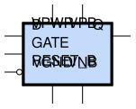

sg13g2_dlhrq_1
==============

High-Active Gate Single-Output Q D-latch with Low-Active Reset

-  **Cell name**: sg13g2_dlhrq_1
-  **Type**: cell
-  **Verilog name**: sg13g2_dlhrq_1
-  **Library**: sg13g2_stdcell
-  **Inputs**:  3 (D, GATE, RESET_B)
-  **Outputs**: 1 (Q)

Electrical and Physical Data
----------------------------

-  **Area**: 27.216 µm²
-  **Pin Capacitance**:

   .. list-table::
      :widths: 50 50
      :header-rows: 1

      * - Pin
        - Capacitance (pF)
      * - D
        - 0.00212744
      * - GATE
        - 0.00218896
      * - Q
        - 0.001
      * - RESET_B
        - 0.00294627

sg13g2_dlhrq_1 symbol
---------------------

    sg13g2_dlhrq_1 symbol

sg13g2_dlhrq_1 schematic
------------------------

.. figure:: ../../../_static/schematics/sg13g2_dlhrq_1.svg
    :align: center
    :width: 80%

    sg13g2_dlhrq_1 schematic

sg13g2_dlhrq_1 GDSII layouts
-----------------------------

.. figure:: ../../../_static/images/sg13g2_dlhrq_1.png
    :align: center
    :width: 80%

    sg13g2_dlhrq_1 layout
