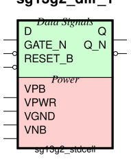
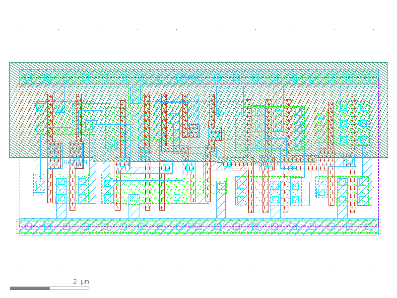

sg13g2_dllr
===========

Low-Active GATE_N Two-Outputs Q Q_N D-latch with Low-Active Reset

-  **Group name**: sg13g2_dllr
-  **Type**: cell
-  **Library**: sg13g2_stdcell
-  **Inputs**:  3 (D, GATE_N, RESET_B)
-  **Outputs**: 2 (Q, Q_N)

sg13g2_dllr symbols
-------------------

    sg13g2_dllr symbol

sg13g2_dllr schematic
---------------------

.. figure:: ../../../_static/schematics/sg13g2_dllr_1.svg
    :align: center
    :width: 80%

    sg13g2_dllr schematic

sg13g2_dllr GDSII layouts
--------------------------

sg13g2_dllr_1
~~~~~~~~~~~~~

-  **Area**: 34.4736 µm²
-  **Pin Capacitance**:

   .. list-table::
      :widths: 50 50
      :header-rows: 1

      * - Pin
        - Capacitance (pF)
      * - D
        - 0.00214712
      * - GATE_N
        - 0.002304
      * - Q
        - 0.001
      * - Q_N
        - 0.001
      * - RESET_B
        - 0.0030741

    sg13g2_dllr_1 layout
