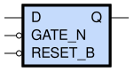

sg13g2_dllrq
============

Low-Active GATE_N Single-Output Q D-latch with Low-Active Reset

-  **Group name**: sg13g2_dllrq
-  **Type**: cell
-  **Library**: sg13g2_stdcell
-  **Inputs**:  3 (D, GATE_N, RESET_B)
-  **Outputs**: 1 (Q)

sg13g2_dllrq symbols
--------------------

    sg13g2_dllrq symbol

sg13g2_dllrq schematic
----------------------

.. figure:: ../../../_static/schematics/sg13g2_dllrq_1.svg
    :align: center
    :width: 80%

    sg13g2_dllrq schematic

sg13g2_dllrq GDSII layouts
---------------------------

sg13g2_dllrq_1
~~~~~~~~~~~~~~

-  **Area**: 29.0304 µm²
-  **Pin Capacitance**:

   .. list-table::
      :widths: 50 50
      :header-rows: 1

      * - Pin
        - Capacitance (pF)
      * - D
        - 0.00203855
      * - GATE_N
        - 0.00217115
      * - Q
        - 0.001
      * - RESET_B
        - 0.00298489

.. figure:: ../../../_static/images/sg13g2_dllrq_1.png
    :align: center
    :width: 80%

    sg13g2_dllrq_1 layout
