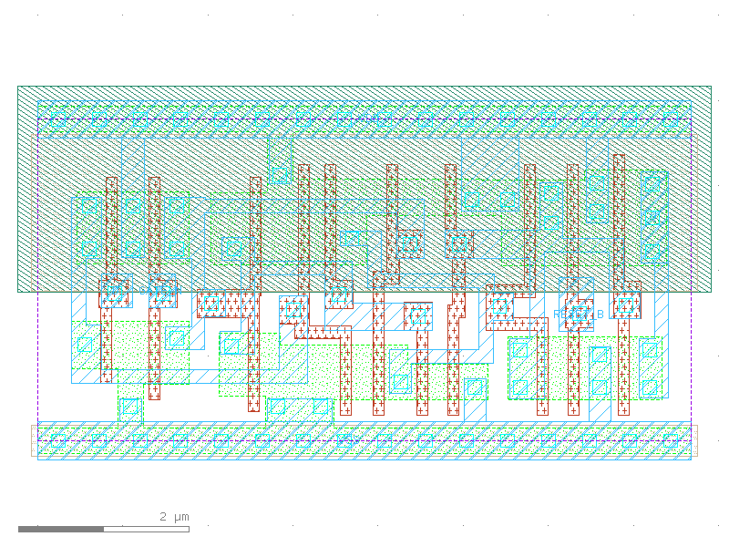

sg13g2_dllrq_1
==============

Low-Active GATE_N Single-Output Q D-latch with Low-Active Reset

-  **Cell name**: sg13g2_dllrq_1
-  **Type**: cell
-  **Verilog name**: sg13g2_dllrq_1
-  **Library**: sg13g2_stdcell
-  **Inputs**:  3 (D, GATE_N, RESET_B)
-  **Outputs**: 1 (Q)

sg13g2_dllrq_1 GDSII layouts
-----------------------------

    sg13g2_dllrq_1
