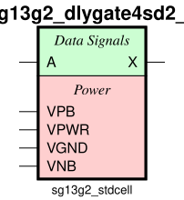

sg13g2_dlygate4sd2
==================

Delay Cell, typical 0.45 ns

-  **Group name**: sg13g2_dlygate4sd2
-  **Type**: cell
-  **Library**: sg13g2_stdcell
-  **Inputs**:  1 (A)
-  **Outputs**: 1 (X)

sg13g2_dlygate4sd2 symbols
--------------------------

    sg13g2_dlygate4sd2 symbol

sg13g2_dlygate4sd2 schematic
----------------------------

.. figure:: ../../../_static/schematics/sg13g2_dlygate4sd2_1.svg
    :align: center
    :width: 80%

    sg13g2_dlygate4sd2 schematic

sg13g2_dlygate4sd2 GDSII layouts
---------------------------------

sg13g2_dlygate4sd2_1
~~~~~~~~~~~~~~~~~~~~

-  **Area**: 14.5152 µm²
-  **Pin Capacitance**:

   .. list-table::
      :widths: 50 50
      :header-rows: 1

      * - Pin
        - Capacitance (pF)
      * - A
        - 0.00148265
      * - X
        - 0.001

    sg13g2_dlygate4sd2_1 layout
