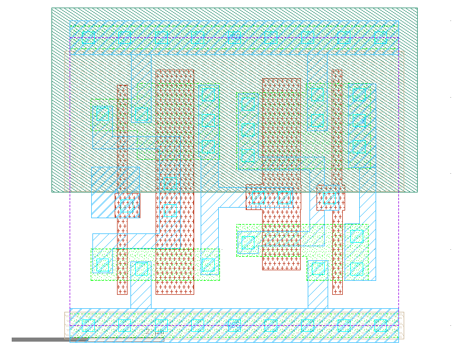

sg13g2_dlygate4sd3_1
====================

Delay Cell, typical 0.7 ns

-  **Cell name**: sg13g2_dlygate4sd3_1
-  **Type**: cell
-  **Verilog name**: sg13g2_dlygate4sd3_1
-  **Library**: sg13g2_stdcell
-  **Inputs**:  1 (A)
-  **Outputs**: 1 (X)

sg13g2_dlygate4sd3_1 schematic
------------------------------

.. figure:: ../../../_static/schematics/sg13g2_dlygate4sd3_1.svg
    :align: center
    :width: 80%

    sg13g2_dlygate4sd3_1 schematic

sg13g2_dlygate4sd3_1 GDSII layouts
-----------------------------------

    sg13g2_dlygate4sd3_1 layout
