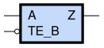

sg13g2_ebufn
============

Tristate Buffer with Low-Active Enable TE_B

-  **Group name**: sg13g2_ebufn
-  **Type**: cell
-  **Library**: sg13g2_stdcell
-  **Inputs**:  2 (A, TE_B)
-  **Outputs**: 1 (Z)

sg13g2_ebufn symbols
--------------------

    sg13g2_ebufn symbol

sg13g2_ebufn schematic
----------------------

.. figure:: ../../../_static/schematics/sg13g2_ebufn_2.svg
    :align: center
    :width: 80%

    sg13g2_ebufn schematic

sg13g2_ebufn GDSII layouts
---------------------------

sg13g2_ebufn_2
~~~~~~~~~~~~~~

-  **Area**: 18.144 µm²
-  **Pin Capacitance**:

   .. list-table::
      :widths: 50 50
      :header-rows: 1

      * - Pin
        - Capacitance (pF)
      * - A
        - 0.00261694
      * - TE_B
        - 0.00638076
      * - Z
        - 0.001

.. figure:: ../../../_static/images/sg13g2_ebufn_2.png
    :align: center
    :width: 80%

    sg13g2_ebufn_2 layout

sg13g2_ebufn_4
~~~~~~~~~~~~~~

-  **Area**: 27.216 µm²
-  **Pin Capacitance**:

   .. list-table::
      :widths: 50 50
      :header-rows: 1

      * - Pin
        - Capacitance (pF)
      * - A
        - 0.00295943
      * - TE_B
        - 0.0104467
      * - Z
        - 0.001

.. figure:: ../../../_static/images/sg13g2_ebufn_4.png
    :align: center
    :width: 80%

    sg13g2_ebufn_4 layout

sg13g2_ebufn_8
~~~~~~~~~~~~~~

-  **Area**: 45.36 µm²
-  **Pin Capacitance**:

   .. list-table::
      :widths: 50 50
      :header-rows: 1

      * - Pin
        - Capacitance (pF)
      * - A
        - 0.00577312
      * - TE_B
        - 0.0175575
      * - Z
        - 0.001

.. figure:: ../../../_static/images/sg13g2_ebufn_8.png
    :align: center
    :width: 80%

    sg13g2_ebufn_8 layout
