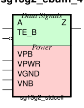

sg13g2_ebufn_4
==============

Tristate Buffer with Low-Active Enable TE_B

-  **Cell name**: sg13g2_ebufn_4
-  **Type**: cell
-  **Verilog name**: sg13g2_ebufn_4
-  **Library**: sg13g2_stdcell
-  **Inputs**:  2 (A, TE_B)
-  **Outputs**: 1 (Z)

sg13g2_ebufn_4 symbol
---------------------

    sg13g2_ebufn_4 symbol

sg13g2_ebufn_4 schematic
------------------------

.. figure:: ../../../_static/schematics/sg13g2_ebufn_4.svg
    :align: center
    :width: 80%

    sg13g2_ebufn_4 schematic

sg13g2_ebufn_4 GDSII layouts
-----------------------------

    sg13g2_ebufn_4 layout
