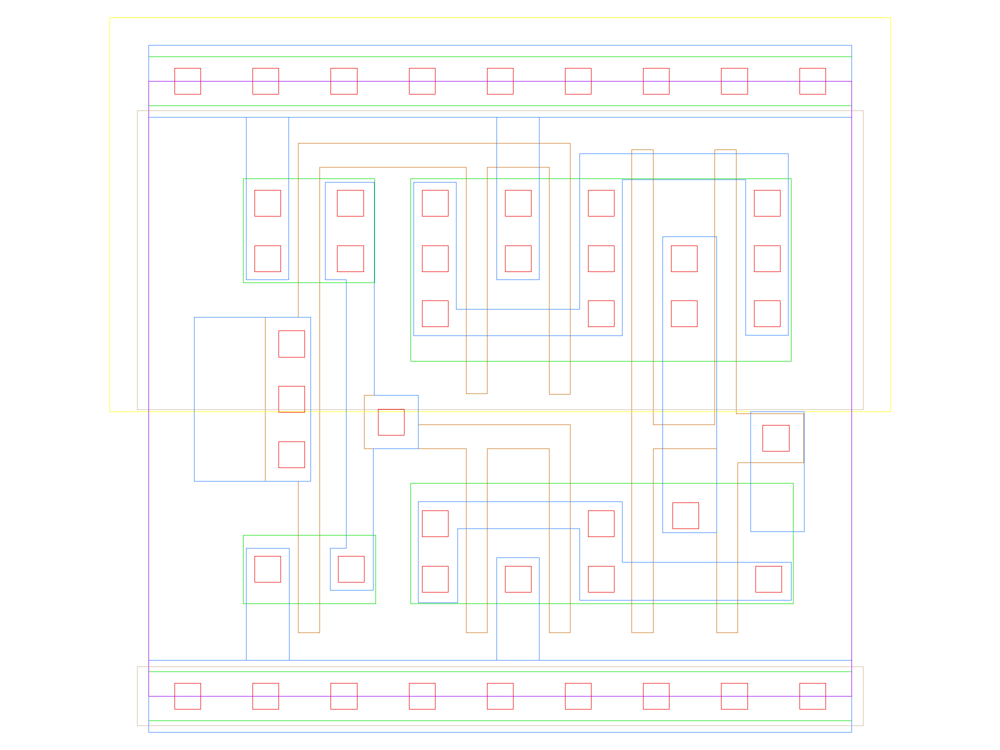

sg13g2_einvn
============

Tristate Inverter with Low-Active Enable TE_B

-  **Group name**: sg13g2_einvn
-  **Type**: cell
-  **Library**: sg13g2_stdcell
-  **Inputs**:  2 (A, TE_B)
-  **Outputs**: 1 (Z)

sg13g2_einvn symbols
--------------------

.. figure:: ../../../_static/symbols/sg13g2_einvn_2.svg
    :align: center
    :width: 60%

    sg13g2_einvn symbol

sg13g2_einvn schematic
----------------------

.. figure:: ../../../_static/schematics/sg13g2_einvn_2.svg
    :align: center
    :width: 80%

    sg13g2_einvn schematic

sg13g2_einvn GDSII layouts
---------------------------

sg13g2_einvn_2
~~~~~~~~~~~~~~

-  **Area**: 16.3296 µm²
-  **Pin Capacitance**:

   .. list-table::
      :widths: 50 50
      :header-rows: 1

      * - Pin
        - Capacitance (pF)
      * - A
        - 0.00408184
      * - TE_B
        - 0.00486017
      * - Z
        - 0.001

    sg13g2_einvn_2 layout

sg13g2_einvn_4
~~~~~~~~~~~~~~

-  **Area**: 23.5872 µm²
-  **Pin Capacitance**:

   .. list-table::
      :widths: 50 50
      :header-rows: 1

      * - Pin
        - Capacitance (pF)
      * - A
        - 0.00796158
      * - TE_B
        - 0.00906303
      * - Z
        - 0.001

.. figure:: ../../../_static/images/sg13g2_einvn_4.png
    :align: center
    :width: 80%

    sg13g2_einvn_4 layout

sg13g2_einvn_8
~~~~~~~~~~~~~~

-  **Area**: 39.9168 µm²
-  **Pin Capacitance**:

   .. list-table::
      :widths: 50 50
      :header-rows: 1

      * - Pin
        - Capacitance (pF)
      * - A
        - 0.0157512
      * - TE_B
        - 0.0155516
      * - Z
        - 0.001

.. figure:: ../../../_static/images/sg13g2_einvn_8.png
    :align: center
    :width: 80%

    sg13g2_einvn_8 layout
