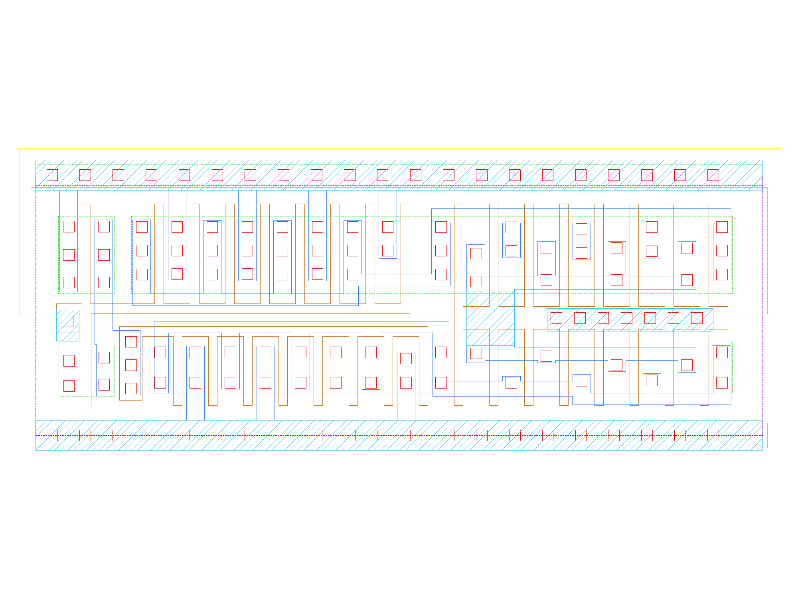

sg13g2_einvn_8
==============

**ITL**

-  **Cell name**: sg13g2_einvn_8
-  **Type**: cell
-  **Verilog name**: sg13g2_einvn_8
-  **Library**: sg13g2_stdcell
-  **Inputs**:  2 (A, TE_B)
-  **Outputs**: 1 (Z)

sg13g2_einvn_8 GDSII layouts
-----------------------------

    sg13g2_einvn_8
