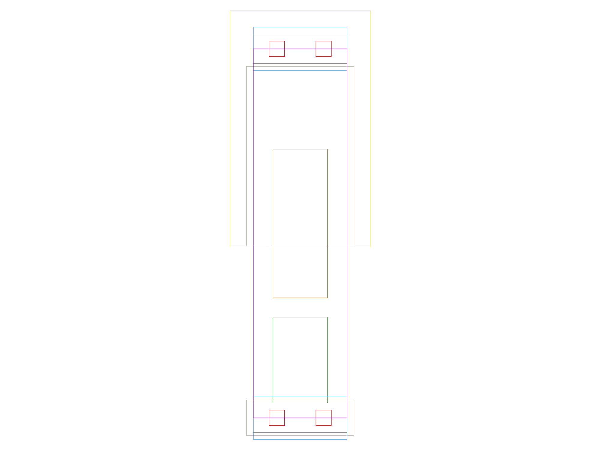
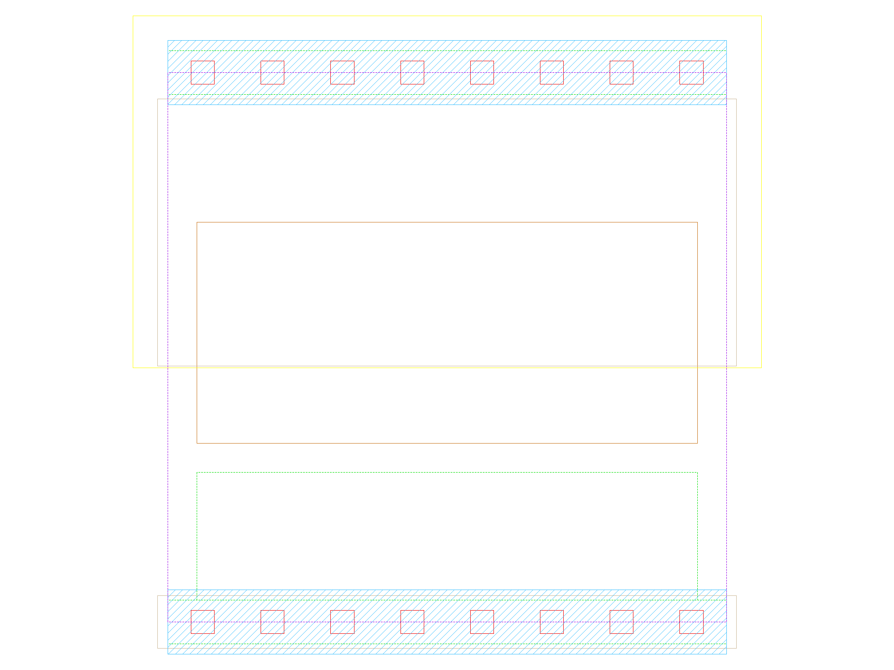

sg13g2_fill
===========

Filler 1 Track Width

-  **Group name**: sg13g2_fill
-  **Type**: cell
-  **Library**: sg13g2_stdcell
-  **Inputs**:  0 ()
-  **Outputs**: 0 ()

sg13g2_fill symbols
-------------------

.. figure:: ../../../_static/symbols/sg13g2_fill_1.svg
    :align: center
    :width: 60%

    sg13g2_fill symbol

sg13g2_fill schematic
---------------------

.. figure:: ../../../_static/schematics/sg13g2_fill_1.svg
    :align: center
    :width: 80%

    sg13g2_fill schematic

sg13g2_fill GDSII layouts
--------------------------

sg13g2_fill_1
~~~~~~~~~~~~~

-  **Area**: 1.8144 µm²

.. figure:: ../../../_static/images/sg13g2_fill_1.png
    :align: center
    :width: 80%

    sg13g2_fill_1 layout

sg13g2_fill_2
~~~~~~~~~~~~~

-  **Area**: 3.6288 µm²

    sg13g2_fill_2 layout

sg13g2_fill_4
~~~~~~~~~~~~~

-  **Area**: 7.2576 µm²

.. figure:: ../../../_static/images/sg13g2_fill_4.png
    :align: center
    :width: 80%

    sg13g2_fill_4 layout

sg13g2_fill_8
~~~~~~~~~~~~~

-  **Area**: 14.5152 µm²

    sg13g2_fill_8 layout
