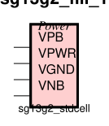
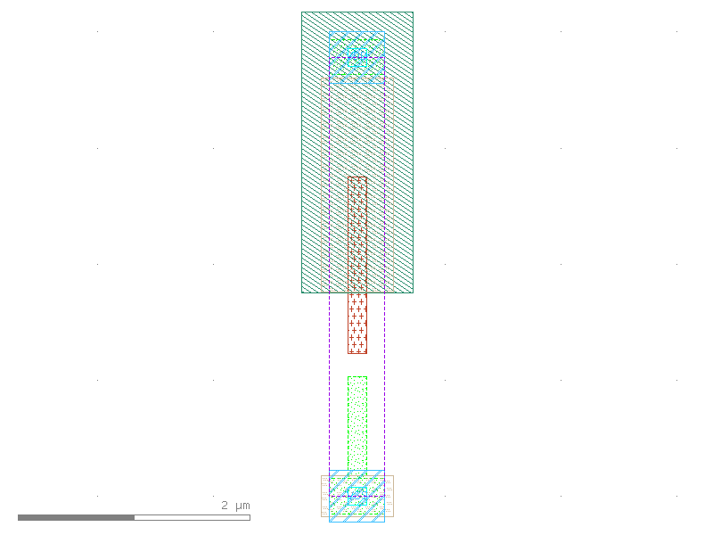

sg13g2_fill_1
=============

Filler 1 Track Width

-  **Cell name**: sg13g2_fill_1
-  **Type**: cell
-  **Verilog name**: sg13g2_fill_1
-  **Library**: sg13g2_stdcell
-  **Inputs**:  0 ()
-  **Outputs**: 0 ()

Electrical and Physical Data
----------------------------

-  **Area**: 1.8144 µm²

sg13g2_fill_1 symbol
--------------------

    sg13g2_fill_1 symbol

sg13g2_fill_1 schematic
-----------------------

.. figure:: ../../../_static/schematics/sg13g2_fill_1.svg
    :align: center
    :width: 80%

    sg13g2_fill_1 schematic

sg13g2_fill_1 GDSII layouts
----------------------------

    sg13g2_fill_1 layout
