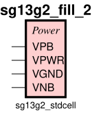

sg13g2_fill_2
=============

Filler 2 Tracks Width

-  **Cell name**: sg13g2_fill_2
-  **Type**: cell
-  **Verilog name**: sg13g2_fill_2
-  **Library**: sg13g2_stdcell
-  **Inputs**:  0 ()
-  **Outputs**: 0 ()

Electrical and Physical Data
----------------------------

-  **Area**: 3.6288 µm²

sg13g2_fill_2 symbol
--------------------

    sg13g2_fill_2 symbol

sg13g2_fill_2 schematic
-----------------------

.. figure:: ../../../_static/schematics/sg13g2_fill_2.svg
    :align: center
    :width: 80%

    sg13g2_fill_2 schematic

sg13g2_fill_2 GDSII layouts
----------------------------

.. figure:: ../../../_static/images/sg13g2_fill_2.png
    :align: center
    :width: 80%

    sg13g2_fill_2 layout
