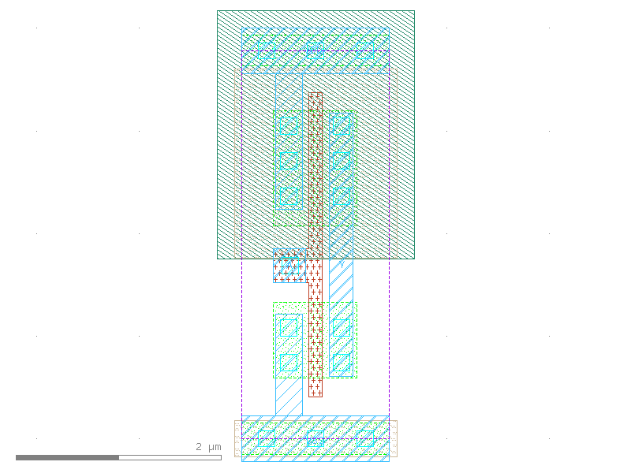
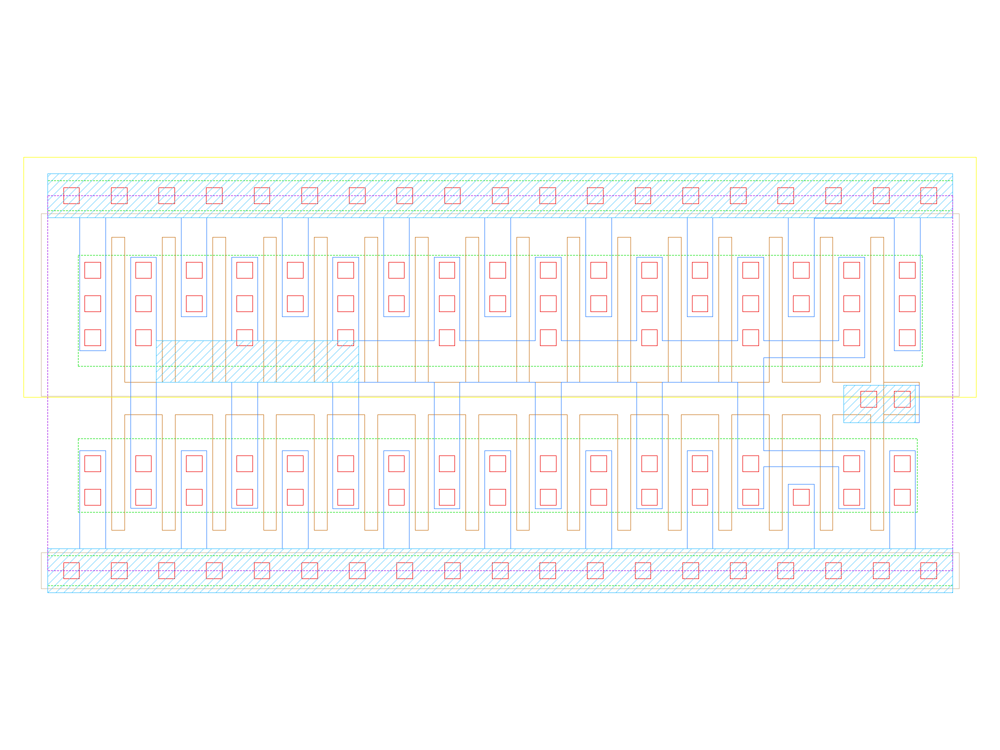
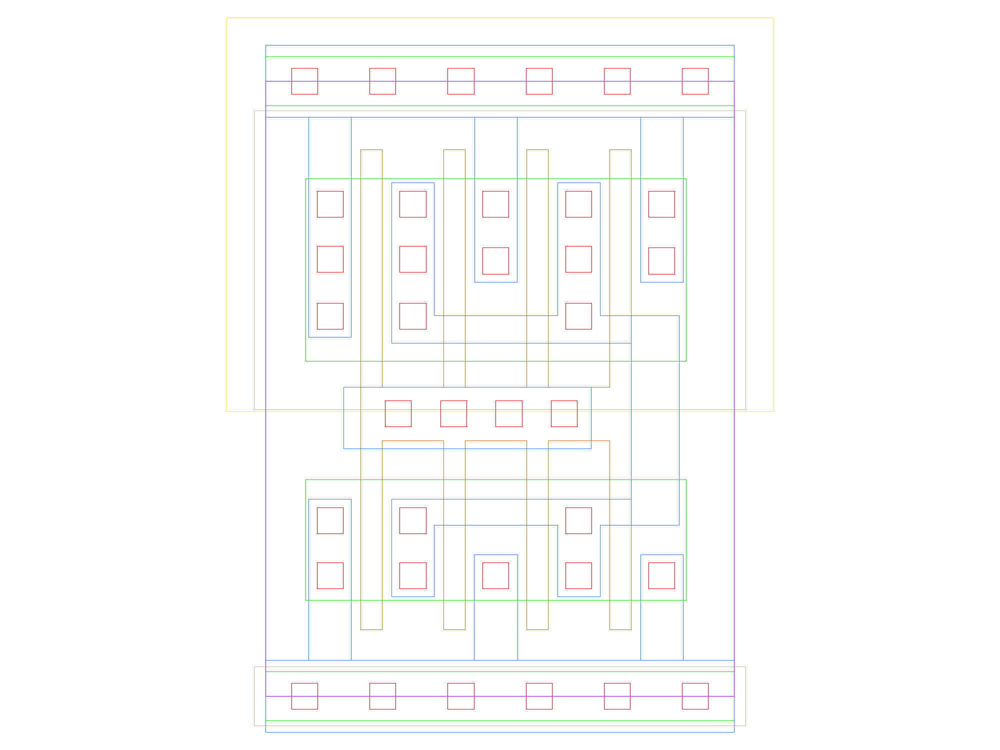

sg13g2_inv
==========

Inverter

-  **Group name**: sg13g2_inv
-  **Type**: cell
-  **Library**: sg13g2_stdcell
-  **Inputs**:  1 (A)
-  **Outputs**: 1 (Y)

sg13g2_inv symbols
------------------

.. figure:: ../../../_static/symbols/sg13g2_inv_1.svg
    :align: center
    :width: 60%

    sg13g2_inv symbol

sg13g2_inv schematic
--------------------

    sg13g2_inv schematic

sg13g2_inv GDSII layouts
-------------------------

sg13g2_inv_1
~~~~~~~~~~~~

-  **Area**: 5.4432 µm²
-  **Pin Capacitance**:

   .. list-table::
      :widths: 50 50
      :header-rows: 1

      * - Pin
        - Capacitance (pF)
      * - A
        - 0.00286745
      * - Y
        - 0.001

    sg13g2_inv_1 layout

sg13g2_inv_16
~~~~~~~~~~~~~

-  **Area**: 34.4736 µm²
-  **Pin Capacitance**:

   .. list-table::
      :widths: 50 50
      :header-rows: 1

      * - Pin
        - Capacitance (pF)
      * - A
        - 0.0435406
      * - Y
        - 0.001

    sg13g2_inv_16 layout

sg13g2_inv_2
~~~~~~~~~~~~

-  **Area**: 7.2576 µm²
-  **Pin Capacitance**:

   .. list-table::
      :widths: 50 50
      :header-rows: 1

      * - Pin
        - Capacitance (pF)
      * - A
        - 0.00567488
      * - Y
        - 0.001

.. figure:: ../../../_static/images/sg13g2_inv_2.png
    :align: center
    :width: 80%

    sg13g2_inv_2 layout

sg13g2_inv_4
~~~~~~~~~~~~

-  **Area**: 10.8864 µm²
-  **Pin Capacitance**:

   .. list-table::
      :widths: 50 50
      :header-rows: 1

      * - Pin
        - Capacitance (pF)
      * - A
        - 0.0112211
      * - Y
        - 0.001

    sg13g2_inv_4 layout

sg13g2_inv_8
~~~~~~~~~~~~

-  **Area**: 18.144 µm²
-  **Pin Capacitance**:

   .. list-table::
      :widths: 50 50
      :header-rows: 1

      * - Pin
        - Capacitance (pF)
      * - A
        - 0.0224507
      * - Y
        - 0.001

.. figure:: ../../../_static/images/sg13g2_inv_8.png
    :align: center
    :width: 80%

    sg13g2_inv_8 layout
