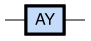
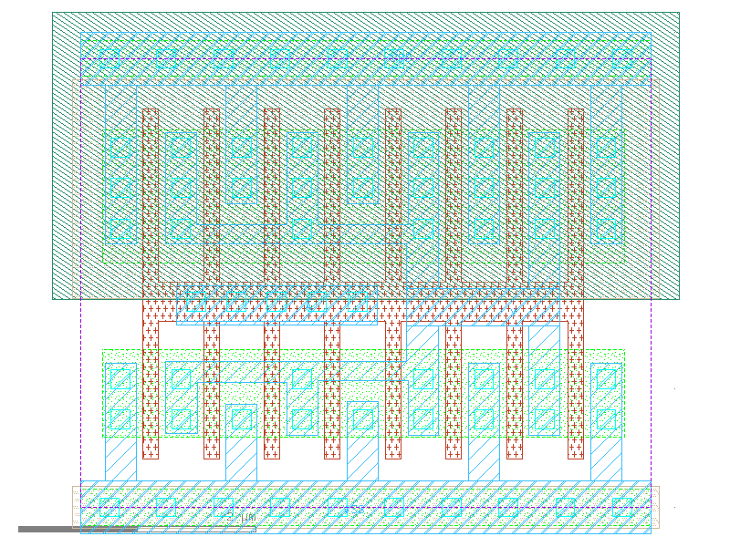

sg13g2_inv_8
============

Inverter

-  **Cell name**: sg13g2_inv_8
-  **Type**: cell
-  **Verilog name**: sg13g2_inv_8
-  **Library**: sg13g2_stdcell
-  **Inputs**:  1 (A)
-  **Outputs**: 1 (Y)

Electrical and Physical Data
----------------------------

-  **Area**: 18.144 µm²
-  **Pin Capacitance**:

   .. list-table::
      :widths: 50 50
      :header-rows: 1

      * - Pin
        - Capacitance (pF)
      * - A
        - 0.0224507
      * - Y
        - 0.001

sg13g2_inv_8 symbol
-------------------

    sg13g2_inv_8 symbol

sg13g2_inv_8 schematic
----------------------

    sg13g2_inv_8 schematic

sg13g2_inv_8 GDSII layouts
---------------------------

    sg13g2_inv_8 layout
