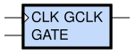
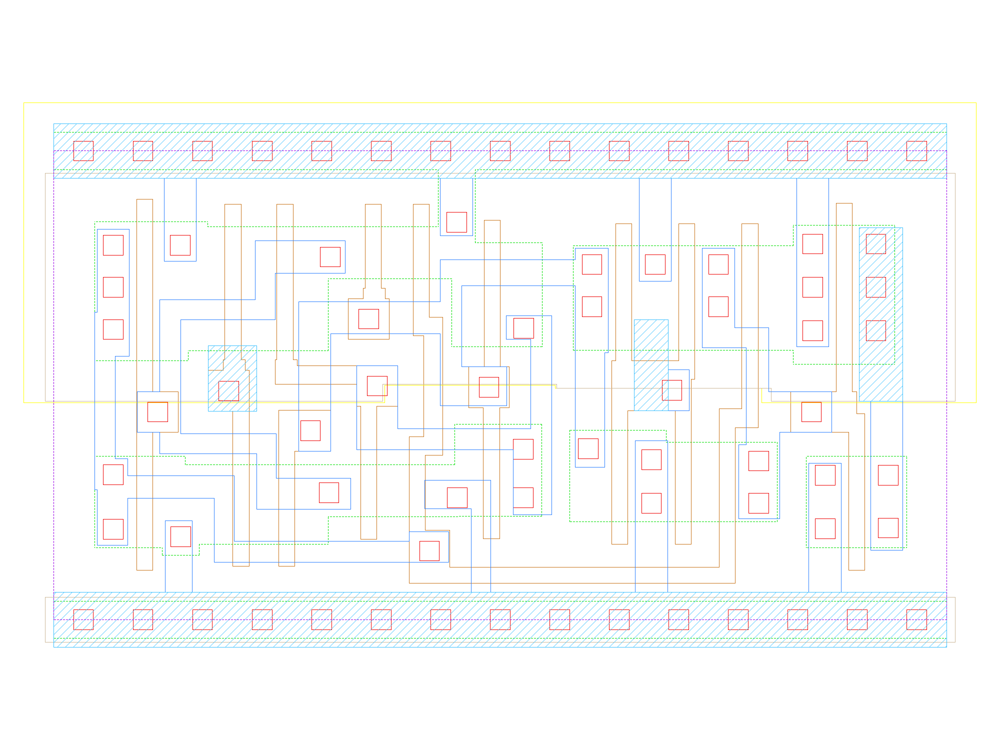

sg13g2_lgcp_1
=============

Posedge Clock Gating cell, Low Latch Enable

-  **Cell name**: sg13g2_lgcp_1
-  **Type**: cell
-  **Verilog name**: sg13g2_lgcp_1
-  **Library**: sg13g2_stdcell
-  **Inputs**:  2 (CLK, GATE)
-  **Outputs**: 1 (GCLK)

Electrical and Physical Data
----------------------------

-  **Area**: 27.216 µm²
-  **Pin Capacitance**:

   .. list-table::
      :widths: 50 50
      :header-rows: 1

      * - Pin
        - Capacitance (pF)
      * - CLK
        - 0.00493856
      * - GATE
        - 0.002298
      * - GCLK
        - 0.001
      * - int_GATE
        - 0

sg13g2_lgcp_1 symbol
--------------------

    sg13g2_lgcp_1 symbol

sg13g2_lgcp_1 schematic
-----------------------

.. figure:: ../../../_static/schematics/sg13g2_lgcp_1.svg
    :align: center
    :width: 80%

    sg13g2_lgcp_1 schematic

sg13g2_lgcp_1 GDSII layouts
----------------------------

    sg13g2_lgcp_1 layout
