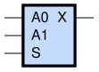
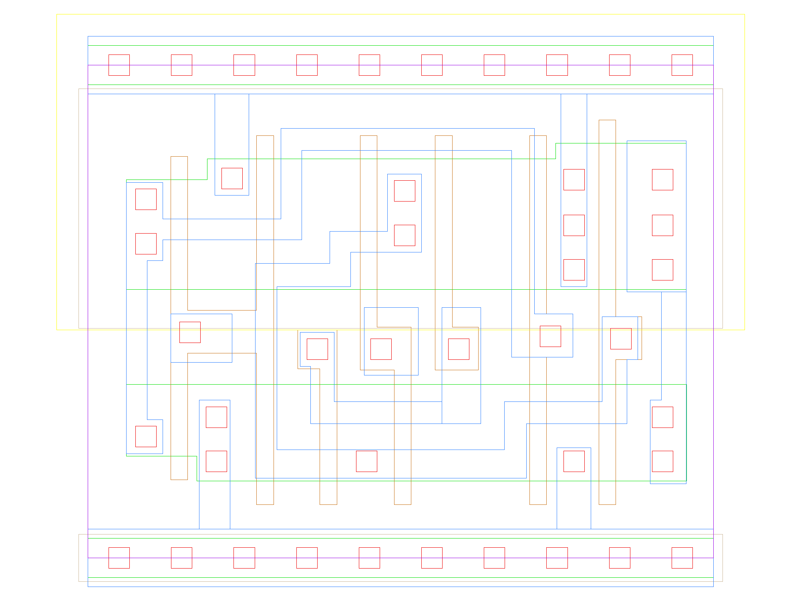

sg13g2_mux2_1
=============

Multiplexer from 2 to 1

-  **Cell name**: sg13g2_mux2_1
-  **Type**: cell
-  **Verilog name**: sg13g2_mux2_1
-  **Library**: sg13g2_stdcell
-  **Inputs**:  3 (A0, A1, S)
-  **Outputs**: 1 (X)

Electrical and Physical Data
----------------------------

-  **Area**: 18.144 µm²
-  **Pin Capacitance**:

   .. list-table::
      :widths: 50 50
      :header-rows: 1

      * - Pin
        - Capacitance (pF)
      * - A0
        - 0.00278055
      * - A1
        - 0.00288461
      * - S
        - 0.00505031
      * - X
        - 0.001

sg13g2_mux2_1 symbol
--------------------

    sg13g2_mux2_1 symbol

sg13g2_mux2_1 schematic
-----------------------

.. figure:: ../../../_static/schematics/sg13g2_mux2_1.svg
    :align: center
    :width: 80%

    sg13g2_mux2_1 schematic

sg13g2_mux2_1 GDSII layouts
----------------------------

    sg13g2_mux2_1 layout
