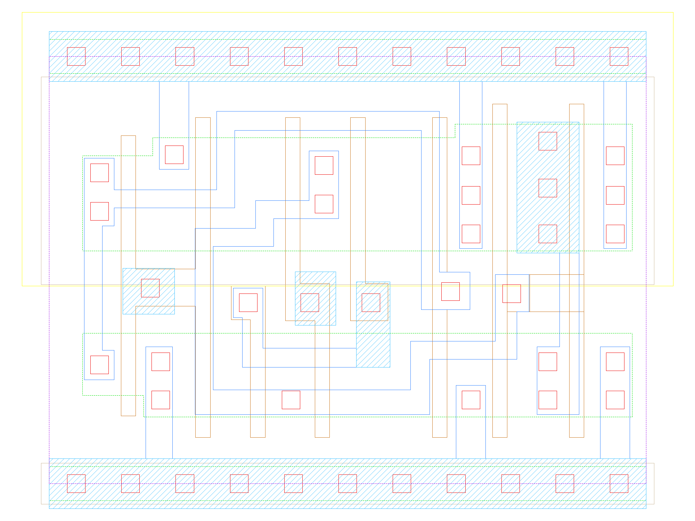

sg13g2_mux2_2
=============

Multiplexer from 2 to 1

-  **Cell name**: sg13g2_mux2_2
-  **Type**: cell
-  **Verilog name**: sg13g2_mux2_2
-  **Library**: sg13g2_stdcell
-  **Inputs**:  3 (A0, A1, S)
-  **Outputs**: 1 (X)

sg13g2_mux2_2 schematic
-----------------------

.. figure:: ../../../_static/schematics/sg13g2_mux2_2.svg
    :align: center
    :width: 80%

    sg13g2_mux2_2 schematic

sg13g2_mux2_2 GDSII layouts
----------------------------

    sg13g2_mux2_2 layout
