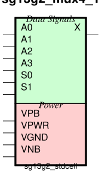
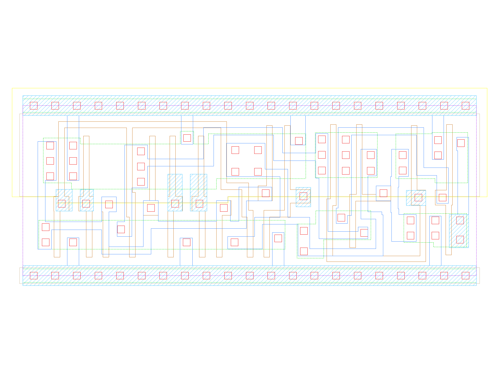

sg13g2_mux4_1
=============

Multiplexer from 4 to 1

-  **Cell name**: sg13g2_mux4_1
-  **Type**: cell
-  **Verilog name**: sg13g2_mux4_1
-  **Library**: sg13g2_stdcell
-  **Inputs**:  6 (A0, A1, A2, A3, S0, S1)
-  **Outputs**: 1 (X)

sg13g2_mux4_1 symbol
--------------------

    sg13g2_mux4_1 symbol

sg13g2_mux4_1 schematic
-----------------------

.. figure:: ../../../_static/schematics/sg13g2_mux4_1.svg
    :align: center
    :width: 80%

    sg13g2_mux4_1 schematic

sg13g2_mux4_1 GDSII layouts
----------------------------

    sg13g2_mux4_1 layout
