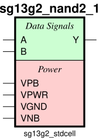
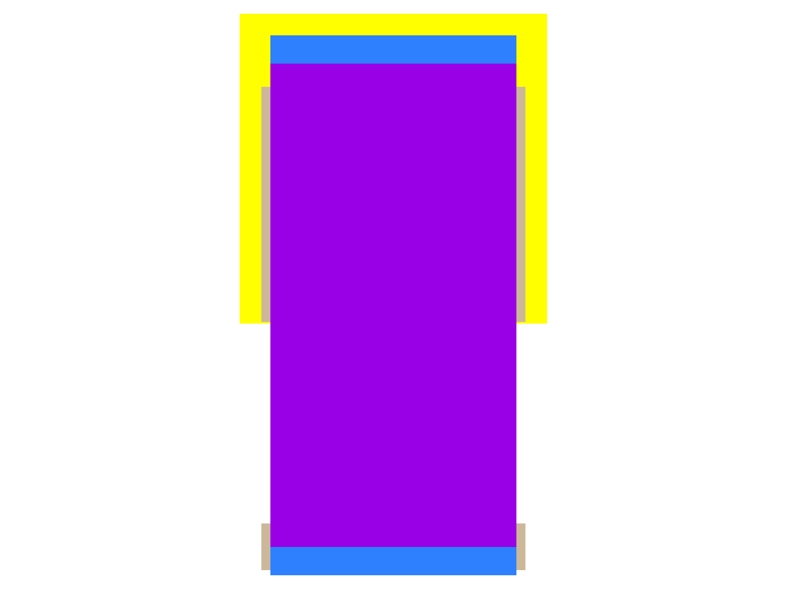
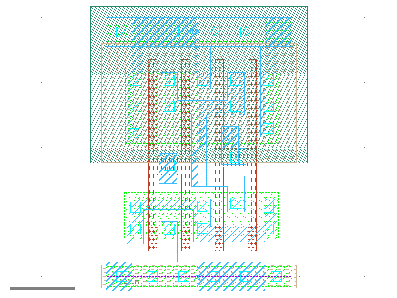

sg13g2_nand2
============

2-input NAND

-  **Group name**: sg13g2_nand2
-  **Type**: cell
-  **Library**: sg13g2_stdcell
-  **Inputs**:  2 (A, B)
-  **Outputs**: 1 (Y)

sg13g2_nand2 symbols
--------------------

    sg13g2_nand2 symbol

sg13g2_nand2 schematic
----------------------

    sg13g2_nand2 schematic

sg13g2_nand2 GDSII layouts
---------------------------

sg13g2_nand2_1
~~~~~~~~~~~~~~

-  **Area**: 7.2576 µm²
-  **Pin Capacitance**:

   .. list-table::
      :widths: 50 50
      :header-rows: 1

      * - Pin
        - Capacitance (pF)
      * - A
        - 0.00288593
      * - B
        - 0.00297812
      * - Y
        - 0.001

    sg13g2_nand2_1 layout

sg13g2_nand2_2
~~~~~~~~~~~~~~

-  **Area**: 10.8864 µm²
-  **Pin Capacitance**:

   .. list-table::
      :widths: 50 50
      :header-rows: 1

      * - Pin
        - Capacitance (pF)
      * - A
        - 0.00559162
      * - B
        - 0.00571313
      * - Y
        - 0.001

    sg13g2_nand2_2 layout
