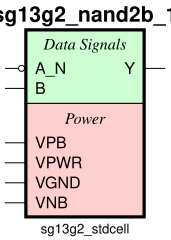

sg13g2_nand2b
=============

2-input NAND with Inverted Input A_N

-  **Group name**: sg13g2_nand2b
-  **Type**: cell
-  **Library**: sg13g2_stdcell
-  **Inputs**:  2 (A_N, B)
-  **Outputs**: 1 (Y)

sg13g2_nand2b symbols
---------------------

    sg13g2_nand2b symbol

sg13g2_nand2b schematic
-----------------------

    sg13g2_nand2b schematic

sg13g2_nand2b GDSII layouts
----------------------------

sg13g2_nand2b_1
~~~~~~~~~~~~~~~

-  **Area**: 9.072 µm²
-  **Pin Capacitance**:

   .. list-table::
      :widths: 50 50
      :header-rows: 1

      * - Pin
        - Capacitance (pF)
      * - A_N
        - 0.00224218
      * - B
        - 0.00302537
      * - Y
        - 0.001

.. figure:: ../../../_static/images/sg13g2_nand2b_1.png
    :align: center
    :width: 80%

    sg13g2_nand2b_1 layout

sg13g2_nand2b_2
~~~~~~~~~~~~~~~

-  **Area**: 14.5152 µm²
-  **Pin Capacitance**:

   .. list-table::
      :widths: 50 50
      :header-rows: 1

      * - Pin
        - Capacitance (pF)
      * - A_N
        - 0.00219968
      * - B
        - 0.00561566
      * - Y
        - 0.001

.. figure:: ../../../_static/images/sg13g2_nand2b_2.png
    :align: center
    :width: 80%

    sg13g2_nand2b_2 layout
