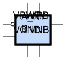

sg13g2_nand2b_2
===============

2-input NAND with Inverted Input A_N

-  **Cell name**: sg13g2_nand2b_2
-  **Type**: cell
-  **Verilog name**: sg13g2_nand2b_2
-  **Library**: sg13g2_stdcell
-  **Inputs**:  2 (A_N, B)
-  **Outputs**: 1 (Y)

Electrical and Physical Data
----------------------------

-  **Area**: 14.5152 µm²
-  **Pin Capacitance**:

   .. list-table::
      :widths: 50 50
      :header-rows: 1

      * - Pin
        - Capacitance (pF)
      * - A_N
        - 0.00219968
      * - B
        - 0.00561566
      * - Y
        - 0.001

sg13g2_nand2b_2 symbol
----------------------

    sg13g2_nand2b_2 symbol

sg13g2_nand2b_2 schematic
-------------------------

    sg13g2_nand2b_2 schematic

sg13g2_nand2b_2 GDSII layouts
------------------------------

.. figure:: ../../../_static/images/sg13g2_nand2b_2.png
    :align: center
    :width: 80%

    sg13g2_nand2b_2 layout
