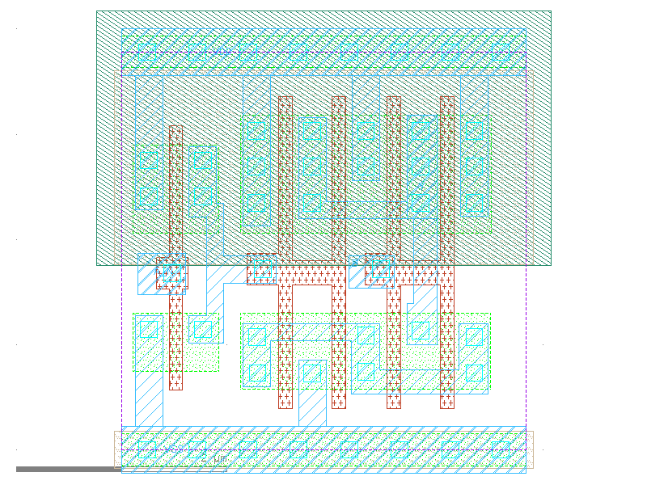

sg13g2_nand2b_2
===============

**nand2b2**

-  **Cell name**: sg13g2_nand2b_2
-  **Type**: cell
-  **Verilog name**: sg13g2_nand2b_2
-  **Library**: sg13g2_stdcell
-  **Inputs**:  2 (A_N, B)
-  **Outputs**: 1 (Y)

sg13g2_nand2b_2 GDSII layouts
------------------------------

    sg13g2_nand2b_2
